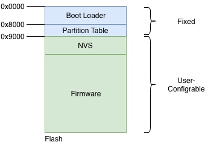
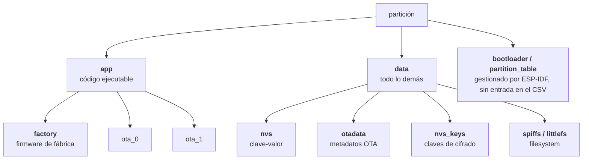
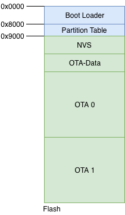

# Tabla de Particiones del ESP32

La flash del ESP32 es, físicamente, un chip aparte soldado en la placa. Desde el punto de vista del ESP32, esa flash es una secuencia larga de bytes —imaginala como una cinta de 4MB sin ninguna marca. En algún lugar de esa cinta vive el firmware. En otro lugar viven las credenciales de WiFi. En otro, los metadatos de OTA. Pero la cinta en sí no dice dónde empieza cada cosa: eso es trabajo del programador definirlo.

La tabla de particiones es la solución a ese problema. Es un directorio que vive al principio de la flash (en la dirección 0x8000 por defecto) y le dice al bootloader cómo está organizado el resto. Sin ese directorio, el bootloader no sabría dónde buscar nada.[^1]

El layout más simple, sin OTA, se ve así:



El bootloader y la tabla de particiones ocupan las primeras posiciones y son fijos. Todo lo que viene después —NVS, firmware— es configurable por el programador.

## Cómo se define la tabla

La tabla de particiones se escribe como un archivo CSV en el proyecto. En `idf.py menuconfig`, bajo *Partition Table*, podés elegir entre las tablas predefinidas que trae ESP-IDF o seleccionar *Custom partition table CSV* para usar la tuya. En ese caso, especificás el nombre del archivo y ESP-IDF lo usa al compilar y flashear.

Cada fila del CSV define una partición con estos campos:

| Campo | Descripción |
|---|---|
| Name | Nombre identificador, máximo 16 caracteres |
| Type | Tipo de partición (`app`, `data`, etc.) |
| SubType | Subtipo según el tipo (`factory`, `nvs`, `ota_0`, etc.) |
| Offset | Dirección de inicio en la flash. Opcional: si se deja vacío, `gen_esp32part.py` lo calcula automáticamente ubicando la partición después de la anterior. Para particiones `app`, también resuelve solo la alineación a 64KB.[^2] |
| Size | Tamaño en bytes, KB, o MB |
| Flags | Opcional. `encrypted` para cifrar con Flash Encryption |

Por ejemplo, la tabla con OTA se ve así en el CSV:

```
# Name,   Type, SubType,  Offset,   Size
nvs,      data, nvs,      0x9000,   0x4000
otadata,  data, ota,      0xd000,   0x2000
phy_init, data, phy,      0xf000,   0x1000
factory,  app,  factory,  0x10000,  1M
ota_0,    app,  ota_0,    0x110000, 1M
ota_1,    app,  ota_1,    0x210000, 1M
```

## Qué define cada entrada

Cada entrada de la tabla describe una región de la flash con tres datos: dónde arranca (su offset), cuánto ocupa (su tamaño), y qué tipo de cosa hay ahí.

Cada entrada tiene un tipo y un subtipo. ESP-IDF define cuatro tipos:

- `app` — código ejecutable que el bootloader puede correr
- `data` — cualquier otra cosa: credenciales, metadatos, filesystems
- `bootloader` y `partition_table` — gestionados automáticamente por ESP-IDF; no requieren entrada en el CSV

En la práctica, al escribir una tabla de particiones solo se trabaja con `app` y `data`. El subtipo hace la distinción más fina dentro de cada tipo: le dice exactamente qué clase de cosa hay en esa región y cómo tratarla.


*Tipos (segundo nivel) y subtipos (tercer nivel). Los tipos auto-gestionados no requieren entradas en el CSV.*

## Qué es cada partición

| Tipo | Subtipo | Descripción | Docs |
|---|---|---|---|
| app | `factory` | Firmware que el bootloader corre por defecto cuando `otadata` está vacío. Es el destino del factory reset (configurable vía GPIO con `CONFIG_BOOTLOADER_FACTORY_RESET`). No soporta rollback. | [Partition Tables](https://docs.espressif.com/projects/esp-idf/en/latest/esp32/api-guides/partition-tables.html), [Factory Reset config](https://docs.espressif.com/projects/esp-idf/en/latest/esp32/api-reference/kconfig-reference.html#config-bootloader-factory-reset) |
| app | `ota_0`, `ota_1` | Slots de firmware para OTA. Mientras el chip corre desde uno, el nuevo firmware se escribe en el otro. | [OTA](https://docs.espressif.com/projects/esp-idf/en/latest/esp32/api-reference/system/ota.html) |
| data | `nvs` | Almacenamiento clave-valor para credenciales y configuración en runtime. Recomendado mínimo 0x3000 bytes. | [NVS](https://docs.espressif.com/projects/esp-idf/en/latest/esp32/api-reference/storage/nvs_flash.html) |
| data | `otadata` | Registra cuál slot OTA está activo. El bootloader lo lee en cada boot. Debe ser 0x2000 bytes. Si está vacío, el bootloader cae a `factory`. | [OTA Data Partition](https://docs.espressif.com/projects/esp-idf/en/latest/esp32/api-reference/system/ota.html#ota-data-partition) |
| data | `nvs_keys` | Claves de cifrado para NVS Encryption. Debe ser exactamente 0x1000 bytes. | [NVS Encryption](https://docs.espressif.com/projects/esp-idf/en/latest/esp32/api-reference/storage/nvs_encryption.html) |
| data | `spiffs` | Filesystem para SPI NOR flash. Soporta wear levelling y consistency checks. | [SPIFFS](https://docs.espressif.com/projects/esp-idf/en/latest/esp32/api-reference/storage/spiffs.html) |
| data | `littlefs` | Filesystem alternativo a SPIFFS, con mejor manejo de corrupción por cortes de luz. | [LittleFS](https://github.com/littlefs-project/littlefs) |

## El layout con OTA

Cuando el proyecto necesita actualizaciones OTA, la tabla de particiones cambia: aparecen dos slots de firmware (`ota_0` y `ota_1`) y una partición `otadata` que registra cuál de los dos está activo.



La razón de necesitar dos slots se explica en detalle en [OTA](../seguridad-iot/ota.md): mientras el chip corre desde uno, el nuevo firmware se escribe en el otro. Si la escritura se interrumpe, el slot activo no fue tocado.

ESP-IDF incluye estas dos tablas predefinidas. La tabla simple:

| Nombre | Tipo | Subtipo | Offset | Tamaño |
|---|---|---|---|---|
| nvs | data | nvs | 0x9000 | 24KB |
| phy_init | data | phy | 0xf000 | 4KB |
| factory | app | factory | 0x10000 | 1MB |

La tabla con OTA:

| Nombre | Tipo | Subtipo | Offset | Tamaño |
|---|---|---|---|---|
| nvs | data | nvs | 0x9000 | 16KB |
| otadata | data | ota | 0xd000 | 8KB |
| phy_init | data | phy | 0xf000 | 4KB |
| factory | app | factory | 0x10000 | 1MB |
| ota_0 | app | ota_0 | 0x110000 | 1MB |
| ota_1 | app | ota_1 | 0x210000 | 1MB |

En la versión con OTA, `nvs` es más chica (16KB en lugar de 24KB) para hacer lugar a `otadata`. Para proyectos que usan NVS con muchas claves, eso puede ser un límite a tener en cuenta.

## Restricciones de alineación

Todos los offsets y tamaños tienen que ser múltiplos de 4KB (0x1000), que es el tamaño de un sector de flash. Las particiones de tipo `app` tienen una restricción adicional: su offset tiene que ser múltiplo de 64KB (0x10000).

Estas restricciones son la causa más común de boot loops al configurar Secure Boot: si la tabla de particiones no está bien alineada, el bootloader rechaza las particiones app y el chip no arranca.

## Referencias

[^1]: Espressif — [Partition Tables](https://docs.espressif.com/projects/esp-idf/en/latest/esp32/api-guides/partition-tables.html), [ESP-Jumpstart: Firmware Upgrade](https://docs.espressif.com/projects/esp-jumpstart/en/latest/esp32/firmwareupgrade.html)
[^2]: Espressif — [Partition Tables: CSV Format](https://docs.espressif.com/projects/esp-idf/en/latest/esp32/api-guides/partition-tables.html#csv-format): *"Partitions with blank offsets in the CSV file will start after the previous partition"* y *"Partitions of type `app` have to be placed at offsets aligned to 0x10000 (64 KB). If you leave the offset field blank, `gen_esp32part.py` will automatically align the partition."*
