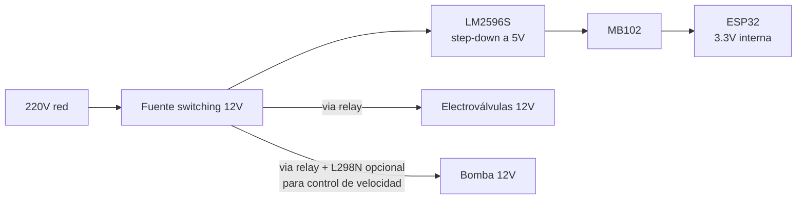

# Arquitectura de Red del Invernadero

## Por qué el invernadero es hostil para WiFi

- **Estructura metálica** (caños, perfiles, malla anti-granizo) atenúa señal 2.4 GHz agresivamente
- **Humedad alta y constante** - el agua absorbe RF, especialmente en 2.4 GHz
- **Plantas densas** - absorción adicional, varía con el crecimiento
- **Motores y bombas** - ruido eléctrico que puede interferir con el radio

Un [ESP32](../hardware/socs/index.md) con antena PCB en estas condiciones puede tener alcance efectivo de **5-10 m** en vez de los 50 m teóricos al aire libre. Detalle en [`wifi-en-invernadero.md`](./wifi-en-invernadero.md).

---

## Escenario A - WiFi directo con antena externa

Válido hasta ~**60-70 m** con estructura metálica.

- Mismo router WiFi existente
- DevKits con módulo variante `U` (conector U.FL) + antena dipolo externa 2-5 dBi
- La antena dipolo externa puede **triplicar el alcance efectivo** en ambiente hostil

**Ventajas:** sin infraestructura extra, setup simple.
**Limitaciones:** depende del alcance del router, punto de falla único.

---

## Escenario B - WiFi mesh

**2-3 APs mesh distribuidos** en el invernadero alimentados con 220V.

- Los nodos [ESP32](../hardware/socs/index.md) se conectan al AP más cercano - la mesh se encarga del handoff
- Los [ESP32](../hardware/socs/index.md) **no necesitan nada especial:** para ellos es un WiFi normal
- Permite usar antena PCB estándar en los DevKits (AP cercano a pocos metros)

**Ventajas:** nodos [ESP32](../hardware/socs/index.md) simples, escalable, cobertura uniforme.
**Costo adicional:** APs mesh c/u (TP-Link Deco, Ubiquiti, GL.iNet).

---

## Escenario C - LoRa para distancias > 100 m o múltiples invernaderos

Para distancias > 100 m o estructuras separadas donde WiFi no alcanza.

- [ESP32](../hardware/socs/index.md) + módulo [LoRa](lora.md) SX1262 en cada nodo
- Gateway central con WiFi ([LilyGo T-Beam](../hardware/devkits/index.md): [LoRa](lora.md) + GPS + WiFi integrados)
- **1-15 km** de alcance en campo abierto, 200-500 m con obstrucciones

> [LoRa](lora.md) tiene muy bajo ancho de banda (~50 kbps max), por lo que solo sirve para telemetría.
> No es apto para cámara o streaming. Para cámara en este escenario hay que usar WiFi local separado.

Detalle en [`lora.md`](./lora.md).

---

## Roles típicos de nodos en un invernadero IoT

Las recetas detalladas por rol (cableado + firmware + topics) están en [`../construccion-nodos/`](../construccion-nodos/).

| Rol | Función | Chip típico | Ver receta |
|---|---|---|---|
| Sensor ambiental | Mide temp + HR + CO2 + luz del aire | C3 / S3 (lo que alcance) | [`nodo-ambiental.md`](../construccion-nodos/nodo-ambiental.md) |
| Actuador | Activa relay / electroválvula / ventilador | C3 (sólo necesita WiFi + GPIO) | [`nodo-actuador.md`](../construccion-nodos/nodo-actuador.md) |
| Cámara | Captura fotos para timelapse o NDVI visual | S3 (PSRAM + interfaz cámara) | [`nodo-camara.md`](../construccion-nodos/nodo-camara.md) |
| Análisis de suelo | Lee capacitivo + opcional pH | C3 (ADC + I2C) | [`nodo-suelo.md`](../construccion-nodos/nodo-suelo.md) |
| Nodo de referencia | Integra sensores de paper en una unidad, no controla nada | S3 (memoria sobrada) | [`nodo-referencia.md`](../construccion-nodos/nodo-referencia.md) |
| Gateway [LoRa](lora.md) (escenario C) | Recibe datos [LoRa](lora.md) de nodos remotos, publica a MQTT | [LilyGo TTGO T-Beam](../hardware/devkits/index.md) | - |

---

## Cadena de alimentación

El [LM2596S](../electronica/potencia/lm2596s.md) es conmutado (eficiente), no lineal, por lo que no disipa calor cerca de sensores de temperatura.

---

## Stack de software

Ver [`mqtt-stack.md`](./mqtt-stack.md) para detalle.

| Capa | Tecnología |
|---|---|
| Firmware | [ESP-IDF](../hardware/frameworks/esp-idf.md) + [PlatformIO](../hardware/frameworks/platformio.md) |
| Protocolo de datos | [MQTT](mqtt-stack.md) |
| Broker | [Mosquitto](mqtt-stack.md) (**local - sin dependencia de internet**) |
| Almacenamiento | [InfluxDB](mqtt-stack.md) (series temporales) |
| Visualización | [Grafana](mqtt-stack.md) |
| Domótica (opcional) | [Home Assistant](mqtt-stack.md) via [MQTT](mqtt-stack.md) |

El broker [MQTT](mqtt-stack.md) local garantiza funcionamiento sin internet, algo crítico para investigación donde la pérdida de datos por falla de conectividad externa es inaceptable.

---

## Consideraciones de ambiente hostil

| Problema | Mitigación |
|---|---|
| Humedad sobre PCB | Gabinete IP54+, conformal coating en zonas críticas |
| Temperatura > 50 $^\circ$C en techo | Ubicar nodos a 1-1.5 m del suelo, no en el techo |
| Electrólisis por humedad + corriente DC en suelo | Sensores capacitivos (no resistivos), aislamiento galvánico en electrónica de potencia |
| Estática por roce con plantas | Pull-down de GPIOs no usados, varistor en la línea de 12V |
| Roedores comiendo cables | Conduit metálico para las líneas principales |
