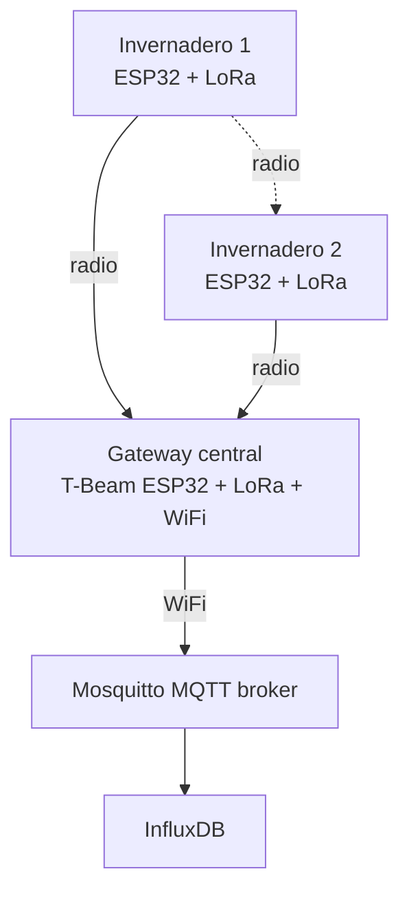

# LoRa / LoRaWAN

Para distancias > 100 m o múltiples estructuras separadas donde WiFi no alcanza.

## Specs básicas

| Aspecto | Valor |
|---|---|
| Radio | Sub-GHz (433 MHz, 868 MHz, 915 MHz según región) |
| Alcance | **1-15 km en campo abierto**, 200-500 m con obstrucciones |
| Velocidad | **~250 bps a 50 kbps** - solo telemetría |
| Cámara o streaming | **No apto** |
| Cobertura por gateway | Un solo gateway cubre todo un predio grande |

### LoRa vs LoRaWAN

- **LoRa** - la modulación del radio. [ESP32](../hardware/socs/index.md) + módulo LoRa + tu propio protocolo punto-a-punto.
- **LoRaWAN** - protocolo de red sobre LoRa con infraestructura de servidores (The Things Network, etc.). Cuando querés roaming, autenticación estándar, integración con servicios públicos.

Para un proyecto privado de invernadero(s) la opción simple es **LoRa puro punto-a-punto**, sin LoRaWAN.

---

## Frecuencias por región

| Región | Banda ISM |
|---|---|
| Europa | 868 MHz |
| América (US, AR, BR, MX) | 915 MHz |
| Asia | 433 MHz / 470 MHz |

**Argentina:** 915 MHz. **Comprar módulos AS923 / US915, no EU868.**

---

## ESP32 + módulo LoRa

El [ESP32](../hardware/socs/index.md) no tiene LoRa integrado; se agrega como módulo externo.

### Opción 1: ESP32 + módulo SX1262/SX1276 separados

| Componente | Valor |
|---|---|
| [ESP32](../hardware/socs/index.md) | Cualquier DevKit (C3, S3, etc.) |
| Módulo | SX1262 (recomendado) o SX1276 (más viejo) |
| Conexión | SPI + algunos GPIO para reset/IRQ |
| Antena | Helicoidal o monopolo, tunada a 915 MHz |

Más laborioso (cablear SPI), pero flexible.

### Opción 2: LilyGo TTGO T-Beam (recomendado para gateways)

- [ESP32](../hardware/socs/index.md) clásico + LoRa SX1276 + GPS NEO-6M integrados
- USB para flasheo + batería 18650 + antena externa
- Referencia estándar para **Meshtastic** y **LoRaWAN gateways**

### Opción 3: Heltec WiFi LoRa 32 V3

- [ESP32-S3](../hardware/socs/esp32-s3.md) + LoRa SX1262 + OLED 0.96"
- USB-C nativo, breadboard-friendly

### Opción 4: LilyGo T-Deck con módulo LoRa opcional

- [ESP32-S3](../hardware/socs/esp32-s3.md) + display 2.8" + teclado QWERTY + LoRa opcional
- Para gateways portátiles con interfaz

---

## Cuándo LoRa en el invernadero

| Caso | LoRa? |
|---|---|
| Invernadero único de $50 \times 30$ m | No - WiFi + mesh alcanza |
| 2 invernaderos separados por 200 m con campo entre medio | **Sí** - LoRa o WiFi long-range |
| Estaciones meteorológicas remotas en el predio (500 m+) | **Sí** - LoRa |
| Nodo de telemetría en otra ubicación (silo, depósito de agua) | **Sí** - LoRa |
| Cámara remota | **No** - LoRa no soporta el ancho de banda. Usar WiFi local o 4G. |

Para un solo invernadero compacto, LoRa típicamente no es necesario - WiFi + mesh alcanza. Considerar agregarlo si el sistema crece a múltiples estructuras separadas o estaciones meteorológicas remotas.

---

## Arquitectura típica con LoRa

El gateway recibe paquetes LoRa de cualquier nodo en el rango, los desempaqueta y los publica al broker [MQTT](mqtt-stack.md) vía WiFi.

---

## Anchor de potencia y duty cycle

LoRa en bandas ISM tiene **límites legales de duty cycle**:

- US915 / AR915: sin límite de duty cycle pero potencia máxima ~30 dBm
- EU868: duty cycle 1% en sub-bandas - para 1 transmisión de 1s, esperar 99 s
- AS923 (Asia/Oceanía): variable según país

Para el invernadero en Argentina: no hay problema legal con duty cycle, pero igual no transmitir más rápido de lo necesario. **1 lectura cada 1-5 min** alcanza para telemetría agronómica y reduce el consumo de batería en los nodos remotos.

---

## Stack de firmware

| Capa | Opción |
|---|---|
| Driver | LoRa de Sandeep Mistry (Arduino) o [ESP-IDF](../hardware/frameworks/esp-idf.md) SX1262 driver oficial |
| Protocolo aplicación | Custom JSON / Protobuf / **CayenneLPP** (compacto, estándar de facto en LoRaWAN) |
| Encriptación | AES-128 sobre el payload (clave compartida) |

> ⚠️ **No mandar lecturas en texto claro por LoRa.** Aunque LoRa no sea "internet", el radio se intercepta con cualquier SDR de Las lecturas de un invernadero comercial pueden ser información sensible (programa de fertilización, ciclos de riego que delaten patrones de operación). Encriptar el payload con AES-128 + clave precompartida en flash de cada nodo. Para producción seria, rotar clave periódicamente vía [OTA](../seguridad-iot/ota-firmado.md).
