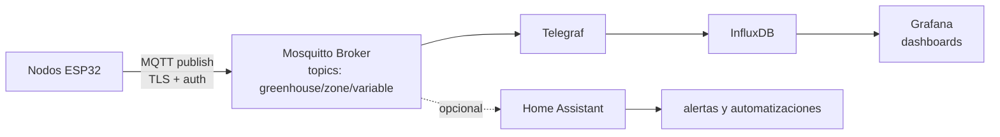

# Stack MQTT - Mosquitto + InfluxDB + Grafana

## Arquitectura



## Por qué local, no cloud

| Razón | Detalle |
|---|---|
| **Sin dependencia de internet** | El invernadero funciona si se cae el ISP. Crítico para investigación con riego automatizado. |
| **Privacidad de datos** | Datos del paper en tu servidor, no en una nube externa |
| **Latencia mínima** | < 10 ms entre nodo y broker en LAN local |
| **Costo cero recurrente** | Nada de subscripciones AWS IoT / Azure IoT Hub |
| **Control total** | Configuración de retención, queries, exportación a tu gusto |

---

## Mosquitto - el broker

**Setup mínimo en un servidor local** (Raspberry Pi, NAS, vieja PC):

```bash
sudo apt install mosquitto mosquitto-clients
```

### `mosquitto.conf` seguro

```conf
# Listener TLS en 8883 (NUNCA usar 1883 sin TLS en producción)
listener 8883
cafile /etc/mosquitto/ca_certificates/ca.crt
certfile /etc/mosquitto/certs/server.crt
keyfile /etc/mosquitto/certs/server.key
tls_version tlsv1.2

# Autenticación obligatoria
allow_anonymous false
password_file /etc/mosquitto/passwd

# Persistencia
persistence true
persistence_location /var/lib/mosquitto/

# Logs
log_dest file /var/log/mosquitto/mosquitto.log
log_type error
log_type warning
log_type notice
log_type information
```

**Crear usuarios:**

```bash
sudo mosquitto_passwd -c /etc/mosquitto/passwd greenhouse_node
# pide password - usar uno generado, no "admin1234"
```

> Ver [`../seguridad-iot/mqtt-tls.md`](../seguridad-iot/mqtt-tls.md) para generación de certs y por qué no podés usar el default `allow_anonymous true` que la mayoría de tutoriales tienen.

---

## Topics - convención del proyecto

```
greenhouse/<zone>/<sensor>/<variable>
```

Ejemplos:

| Topic | Contenido |
|---|---|
| `greenhouse/zone-A/sht45/temp_c` | Temperatura ambiente zona A |
| `greenhouse/zone-A/sht45/humidity_pct` | HR ambiente zona A |
| `greenhouse/zone-A/scd41/co2_ppm` | CO2 zona A |
| `greenhouse/zone-A/as7341/ppfd` | [PAR](../sensores/luz/conceptos-par.md) calculado zona A |
| `greenhouse/zone-A/soil-1/vwc_pct` | [VWC](../sensores/humedad-suelo/vwc.md) sensor 1 zona A |
| `greenhouse/zone-A/soil-1/temp_c` | Temp suelo sensor 1 zona A |
| `greenhouse/zone-A/ezo-ph/value` | pH suelo zona A |
| `greenhouse/zone-A/node/rssi_dbm` | RSSI del nodo (diagnóstico) |
| `greenhouse/zone-A/node/uptime_s` | Uptime del nodo (heartbeat) |
| `greenhouse/zone-A/actuator/pump-1/state` | Estado de bomba 1 |
| `greenhouse/zone-A/actuator/pump-1/cmd` | Comando a bomba 1 (ON/OFF) |

### Por qué este esquema

- Es jerárquico, así te suscribís a todo de una zona con `greenhouse/zone-A/#`.
- El naming es consistente: variable + unidad en el nombre evita ambigüedad.
- El diagnóstico está separado en `node/*` para metadata, no se mezcla con las lecturas.
- Es bidireccional: `state` lo publica el nodo, `cmd` lo publica el sistema de automation.

---

## Payload format

JSON simple, sin pretensiones:

```json
{
 "ts": 1715350800,
 "value": 23.5,
 "unit": "C",
 "node_id": "esp32-zone-a-sensor-1",
 "rssi": -62
}
```

Para sensores con varias variables ([SCD41](../sensores/co2/scd41.md) mide CO2 + temp + HR de una pasada):

```json
{
 "ts": 1715350800,
 "co2_ppm": 850,
 "temp_c": 23.5,
 "humidity_pct": 65.0,
 "node_id": "esp32-zone-a-sensor-1"
}
```

> El timestamp se genera en el nodo, no en el broker. Así, si el broker está caído un rato, los buffers en flash del nodo se vacían después con el `ts` correcto. Sincronizar el reloj del nodo con SNTP al broker o a un servidor confiable de la LAN.

---

## InfluxDB - series temporales

InfluxDB v2.x maneja muy bien millones de puntos en RPi 4 / Mini PC.

### Configuración mínima

```bash
sudo apt install influxdb2
sudo systemctl enable --now influxdb
```

Setup inicial:

```bash
influx setup
# org: greenhouse
# bucket: sensors
# retention: 90d (ajustar según necesidad de paper)
```

### Telegraf como puente MQTT $\rightarrow$ InfluxDB

`/etc/telegraf/telegraf.conf`:

```toml
[[inputs.mqtt_consumer]]
 servers = ["tcp://localhost:8883"]
 topics = ["greenhouse/#"]
 username = "telegraf"
 password = "${TELEGRAF_PASSWORD}" # de variable de entorno, NO hardcoded
 data_format = "json"
 tls_ca = "/etc/mosquitto/ca_certificates/ca.crt"

[[outputs.influxdb_v2]]
 urls = ["http://localhost:8086"]
 token = "${INFLUX_TOKEN}"
 organization = "greenhouse"
 bucket = "sensors"
```

> Las variables `${TELEGRAF_PASSWORD}` y `${INFLUX_TOKEN}` se inyectan desde `/etc/default/telegraf` o un secret manager. **Nunca commitear esos archivos con valores reales** en git.

---

## Grafana - dashboards

```bash
sudo apt install grafana
sudo systemctl enable --now grafana-server
```

- Browser $\rightarrow$ http://servidor:3000
- Default admin/admin $\rightarrow$ **cambiar inmediatamente**, no dejar el default
- Add data source: InfluxDB $\rightarrow$ URL `http://localhost:8086`, token, bucket

### Dashboards típicos para invernadero

1. **Overview**: temp / HR / CO2 / [PAR](../sensores/luz/conceptos-par.md) last 24h por zona
2. **Soil monitoring**: [VWC](../sensores/humedad-suelo/vwc.md) + temp suelo + pH last 7d por sensor
3. **Actuator history**: bombas y válvulas, cuándo se activaron y por cuánto tiempo
4. **Network health**: RSSI por nodo, uptime, mensajes/min al broker
5. **Comparación nodos control vs referencia**: overlay para validación cruzada (paper)

---

## Home Assistant (opcional)

Si querés integrar con Apple Home / Google Home / Alexa:

- HA corre en el mismo servidor que Mosquitto
- Configurar MQTT integration apuntando al broker local
- Auto-discovery via topics `homeassistant/sensor/<id>/config`
- HA puede ejecutar automatizaciones complejas (ej. "si [VWC](../sensores/humedad-suelo/vwc.md) < 15% y temp > $28\,°\text{C}$, activar bomba zona A por 30 s")

> ⚠️ Si conectás HA a HomeKit/Google/Alexa, esos servicios consultan tu HA por internet. Eso significa **abrir una conexión saliente segura** (Nabu Casa o tu propio túnel) - nunca abrir un puerto entrante para HA. Detalle en [`../seguridad-iot/exposicion-externa.md`](../seguridad-iot/exposicion-externa.md).

---

## Cliente MQTT en ESP-IDF

```c
#include "mqtt_client.h"

esp_mqtt_client_config_t mqtt_cfg = {
 .broker.address.uri = "mqtts://192.168.1.10:8883",
 .broker.verification.certificate = (const char *)server_cert_pem_start,
 .credentials.username = "greenhouse_node",
 .credentials.authentication.password = mqtt_password_from_nvs, // ver seguridad-iot/secrets
 .session.keepalive = 60,
 .network.reconnect_timeout_ms = 5000,
};

esp_mqtt_client_handle_t client = esp_mqtt_client_init(&mqtt_cfg);
esp_mqtt_client_register_event(client, ESP_EVENT_ANY_ID, mqtt_event_handler, NULL);
esp_mqtt_client_start(client);

// Publicar
char payload[128];
snprintf(payload, sizeof(payload),
 "{\"ts\":%lld,\"temp_c\":%.2f,\"humidity_pct\":%.2f}",
 time(NULL), temp_c, humidity_pct);
esp_mqtt_client_publish(client, "greenhouse/zone-A/sht45/data",
 payload, 0, 1 /* QoS 1 */, 0);
```

### QoS - qué nivel usar

| QoS | Garantía | Cuándo |
|---|---|---|
| 0 | At most once (fire and forget) | RSSI, telemetría no crítica |
| 1 | At least once (puede duplicar) | **Default para sensores de paper** |
| 2 | Exactly once (más overhead) | Comandos a actuadores (no querés ejecutar 2 veces) |

---

## Buffer local si el broker está caído

Si el broker se reinicia o WiFi falla, los nodos **no deben perder lecturas**:

1. Encolar lecturas en RAM (ringbuffer [FreeRTOS](../hardware/frameworks/esp-idf.md))
2. Si la RAM se llena, persistir las más viejas a flash ([NVS](../seguridad-iot/secrets-en-firmware.md) o LittleFS)
3. Al reconectar, vaciar el buffer en orden FIFO
4. Incluir el `ts` original en cada mensaje (no el ts de envío)

Con [ESP32-S3](../hardware/socs/esp32-s3.md) y 8 MB PSRAM podés guardar **horas** de lecturas a 1/min sin problema.
