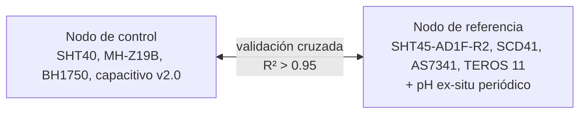

# Nodo de Referencia (Investigación)

**No controla nada.** Solo registra con precisión de laboratorio. Sirve para validar los nodos de control en la metodología del paper.

## Filosofía

Los nodos de control son baratos y abundantes - cubren espacialmente todo el invernadero. Los nodos de referencia son pocos (1-2 unidades) y calibrados - son la "fuente de verdad" contra la que se valida todo lo demás.



## Hardware (integrado al nodo)

| Componente | Notas |
|---|---|
| [ESP32-S3-DevKitC-1 N16R8](../hardware/devkits/espressif/esp32-s3-devkitc-1.md) | PSRAM ayuda al integrar 4 sensores I2C + UART con buffers largos |
| [SHT45-AD1F-R2](../sensores/temperatura-humedad/sht45.md) (Sensirion) | Temp + HR de referencia, filtro PTFE |
| [SCD41](../sensores/co2/scd41.md) (Sensirion) | CO2 + compensación interna T+HR |
| [AS7341](../sensores/luz/as7341.md) ([ams-OSRAM](../sensores/luz/as7341.md)) + level shifter | [PAR](../sensores/luz/conceptos-par.md) espectral, 11 canales |
| [METER TEROS 11](../sensores/humedad-suelo/teros-11.md) (móvil) | [VWC](../sensores/humedad-suelo/vwc.md) + temp suelo (no mide EC - eso es TEROS 12), SDI-12 |
| [Apogee SQ-500](../sensores/luz/apogee-sq-500.md) (calibrador) | Solo para calibrar el [AS7341](../sensores/luz/as7341.md), no se queda fijo |
| [MB102](../electronica/potencia/mb102.md) + [LM2596S](../electronica/potencia/lm2596s.md) | Alimentación estable 5V $\rightarrow$ 3.3V |
| Caja IP65 ventilada | Protección contra humedad |

## Hardware aparte (medición periódica ex-situ, no integrada al nodo)

| Componente | Notas |
|---|---|
| [Atlas Scientific EZO-pH](../sensores/ph-suelo/ezo-ph.md) circuit + electrodo BNC de laboratorio | pH del suelo se mide **semanalmente o quincenal** por muestreo (extracto suelo:agua). El sensor vive en mesada, no en el nodo. Ver [`../sensores/ph-suelo/README.md`](../sensores/ph-suelo/index.md). |

## Por qué ESP32-S3

- **45 GPIO** - suficiente para múltiples buses I2C, UART para SDI-12 vía conversor, etc.
- **PSRAM 8 MB** - buffers largos de lecturas si el broker está temporalmente caído
- **USB nativo** - JTAG/GDB para debug profundo durante validación de drivers

## Cableado I2C - todos los sensores en el mismo bus

```
ESP32-S3 ┐
GPIO8 ───┴─── SDA ────┬───┬───┬─── SHT45 / SCD41 / AS7341 (todos SDA)
 │
 [10kΩ] pull-up a 3.3V

GPIO9 ────── SCL ────┬───┬───┬─── (idem para SCL)
 │
 [10kΩ] pull-up a 3.3V
```

Direcciones I2C (todas distintas, sin conflicto):

| Sensor | Dirección |
|---|---|
| [SHT45](../sensores/temperatura-humedad/sht45.md) | 0x44 |
| [SCD41](../sensores/co2/scd41.md) | 0x62 |
| [AS7341](../sensores/luz/as7341.md) | 0x39 |

## TEROS 11 - protocolo SDI-12

SDI-12 no es I2C ni UART estándar. Opciones:

1. **SDI-12 USB adapter** (Liquidwise, Adafruit) $\rightarrow$ leer desde una PC/RPi en LAN
2. **Conversor SDI-12 a UART** $\rightarrow$ tradicional pero requiere parsear el protocolo
3. **Wemos ESP32-SDI12** - board específico, simplifica el cableado

Para el proyecto: comprar el conversor SDI-12 a UART y leer desde un UART secundario del S3.

```c
// Comando "0M!" para iniciar medición, esperar respuesta del sensor
uart_write_bytes(UART_NUM_2, "0M!", 3);
vTaskDelay(pdMS_TO_TICKS(1500)); // TEROS responde en ~1s
uint8_t buf[64];
int len = uart_read_bytes(UART_NUM_2, buf, sizeof(buf), pdMS_TO_TICKS(500));
// parsear: "0+VWC+temp+EC\r\n"
```

## Calibración inicial - checklist

- [ ] [SHT45](../sensores/temperatura-humedad/sht45.md): validación contra higrómetro de referencia certificado (psicrómetro Assmann o sensor lab)
- [ ] [SCD41](../sensores/co2/scd41.md): factory calibration suele ser válida, opcional verificación contra cilindro de gas calibrado
- [ ] [AS7341](../sensores/luz/as7341.md): calibrar contra [Apogee SQ-500](../sensores/luz/apogee-sq-500.md) en distintas condiciones (luz solar, LED blanco, LED cultivo) - obtener coeficientes a₁..a₈ por regresión multilineal
- [ ] [TEROS 11](../sensores/humedad-suelo/teros-11.md): factory calibration certificado, no requiere recalibrar
- [ ] [EZO-pH](../sensores/ph-suelo/ezo-ph.md) (de mesada, ex-situ): calibrar 3 puntos (pH 4.01, 7.00, 10.00) con buffers NIST-traceable **antes de cada sesión de muestreo**

## Firmware - registro continuo

```c
void reference_node_main(void *arg) {
 while (1) {
 reading_t r = {0};
 r.ts = time(NULL);

 sht45_read(&r.air_temp_c, &r.air_humidity_pct);
 scd41_read(&r.co2_ppm, &r.scd_temp_c, &r.scd_humidity_pct);
 as7341_read_all(&r.spectrum);
 r.ppfd = compute_ppfd(&r.spectrum, calibration_coeffs);
 r.ndvi = (r.spectrum.nir - r.spectrum.f7) /
 (r.spectrum.nir + r.spectrum.f7);

 teros11_read(&r.soil_vwc_pct, &r.soil_temp_c);
 // pH NO se lee acá - se mide aparte, semanal/quincenal, con EZO-pH de mesada
 // y se publica desde ahí al topic `greenhouse/reference/soil-ph/sample`

 publish_reference_reading(&r);

 // 1 lectura/min - más frecuente que los nodos de control
 vTaskDelay(pdMS_TO_TICKS(60000));
 }
}
```

## Topics

| Topic | Frecuencia | Contenido |
|---|---|---|
| `greenhouse/reference/sht45/data` | 1/min | T + HR aire de referencia |
| `greenhouse/reference/scd41/data` | 1/min | CO2 + T + HR |
| `greenhouse/reference/as7341/data` | 1/min | [PPFD](../sensores/luz/conceptos-par.md) + [NDVI](../sensores/luz/conceptos-par.md) + 8 canales + Clear + NIR + Flicker |
| `greenhouse/reference/teros11/data` | 1/min | [VWC](../sensores/humedad-suelo/vwc.md) + T suelo (el TEROS 11 no mide EC) |
| `greenhouse/reference/soil-ph/sample` | **1/semana o quincenal** | pH publicado manualmente desde mesada después de cada muestreo. Incluir metadata: `{"ts","ph","ratio":"1:2.5","zone","slope_mV"}` |
| `greenhouse/reference/node/heartbeat` | 1/min | Heartbeat estándar |

## Estrategia de movimiento del TEROS 11

El [TEROS 11](../sensores/humedad-suelo/teros-11.md) es la pieza más cara. En vez de comprar 5, comprar **1 y rotarlo**:

| Semana | Posición | Nodo de control comparado |
|---|---|---|
| 1-2 | Zona A | Validar capacitivo zona A |
| 3-4 | Zona B | Validar capacitivo zona B |
| 5-6 | Zona C | Validar capacitivo zona C |
| 7-8 | Zona D | Validar capacitivo zona D |
| 9+ | Punto crítico (más variabilidad) | Monitoreo continuo |

Cada rotación: 2 semanas paralelas con el nodo de control, comparar series, calcular $R^2$.

## Texto sugerido para metodología

> "A reference node was deployed alongside the network of low-cost control nodes to provide laboratory-grade measurements for cross-calibration. The reference node included a [SHT45-AD1F-R2](../sensores/temperatura-humedad/sht45.md) (Sensirion AG, $\pm 0.1\,^\circ\text{C}$, $\pm 1\%$ RH, PTFE filter), [SCD41](../sensores/co2/scd41.md) photoacoustic NDIR CO2 sensor (Sensirion AG, $\pm 40\,\text{ppm}$), [AS7341](../sensores/luz/as7341.md) 11-channel spectral sensor ([ams-OSRAM](../sensores/luz/as7341.md), calibrated against an [Apogee SQ-500SS](../sensores/luz/apogee-sq-500.md) quantum sensor for [PPFD](../sensores/luz/conceptos-par.md) computation), and [METER TEROS 11](../sensores/humedad-suelo/teros-11.md) soil sensor ([VWC](../sensores/humedad-suelo/vwc.md) + temperature, factory-calibrated SDI-12 output). The reference node sampled at 1-minute intervals throughout the experimental period. Soil pH was measured separately and periodically (weekly samples) ex-situ following [ASTM D4972](https://www.astm.org/d4972-19.html) (1:2.5 soil:water suspension) using an [Atlas Scientific EZO-pH](../sensores/ph-suelo/ezo-ph.md) circuit with laboratory-grade BNC electrode (3-point NIST-traceable calibration before each sampling session); continuous in-situ measurement of soil pH was excluded as methodologically unreliable. Low-cost control nodes were cross-validated against reference readings via paired $R^2 > 0.95$ over 2-week paired deployments."

## Diferencia operacional con nodos de control

| Aspecto | Control | Referencia |
|---|---|---|
| Cantidad | Muchos (uno por zona) | 1-2 |
| Costo por unidad | |+ |
| Función | Cobertura espacial + control automatizado | Validación, paper |
| Frecuencia de lectura | 1/min | 1/min |
| Topic prefix | `greenhouse/zone-X/...` | `greenhouse/reference/...` |
| Backup local | [NVS](../seguridad-iot/secrets-en-firmware.md) últimos 100 puntos | LittleFS 24h continuos |
| Mantenimiento | Calibración por sustrato | TEROS rota cada 2 sem; [EZO-pH](../sensores/ph-suelo/ezo-ph.md) se recalibra antes de cada sesión de muestreo (semanal) |
