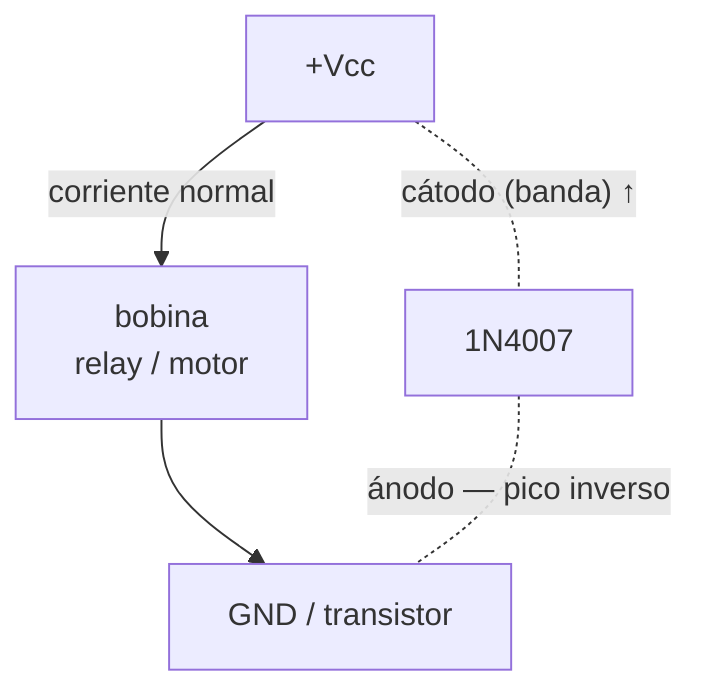

# 1N4007

Rectificador de 1 A - el diodo de propósito general más común. **Es el que usás para flyback en cualquier relay.**

Datasheet típico: [Onsemi 1N4007 (PDF)](https://www.onsemi.com/pdf/datasheet/1n4001-d.pdf) (familia 1N4001-1N4007)

## Specs

| Spec | Valor |
|---|---|
| Tipo | Rectificador silicio |
| Corriente max ($I_{F(AV)}$) | 1 A continuos @ $T_A = 75\,^\circ\text{C}$ |
| Tensión inversa ($V_{RRM}$) | 1000V |
| Caída tensión ($V_F$) | ~1.0 V típ @ 1 A, **1.1 V max @ 1 A** ([Vishay datasheet](https://www.vishay.com/docs/88503/1n4001.pdf)). El "~0.7 V" es la regla de pulgar para baja corriente; a 1 A es ~1 V |
| Tiempo de recuperación ($t_{rr}$) | No especificado en datasheet (es family de "standard recovery" para 50/60 Hz). Valor comunmente citado ~30 µs. **No usar para PWM** |
| Package | DO-41 (through-hole) |

## Uso principal: flyback

## Cuándo no usar 1N4007

- **PWM > 1 kHz** $\rightarrow$ el tiempo de recovery es muy lento, usar [FR107](./fr107.md) en su lugar
- **Protección de alimentación** donde la caída de 0.7V importa $\rightarrow$ usar [1N5819](./1n5819.md) Schottky (Vf ~0.3V)
