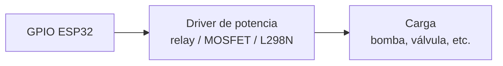

# Módulos de Potencia

Para controlar cargas de 5V+ (bombas, electroválvulas, ventiladores, lámparas, calefactores) desde un ESP32.

## Por qué no se conecta una carga al GPIO directo

El GPIO del ESP32 entrega **~20 mA típicos (default), 40 mA absolute max** ([datasheet Tabla 5-3](https://www.espressif.com/sites/default/files/documentation/esp32_datasheet_en.pdf)). A 3.3V eso son ~66 mW max por pin. Una bomba pequeña consume 500 mA - 2 A a 12V = 6-24 W, varios órdenes de magnitud más. Conectar la bomba al GPIO quema el ESP32 instantáneamente.

Cadena correcta:

## Componentes por función

| Componente | Función |
|---|---|
| [Relay 5V opto-acoplado](./relay-5v-opto.md) | Conmutación on/off de cargas AC o DC con aislamiento galvánico |
| [LM2596S](./lm2596s.md) | Conversión DC-DC eficiente (step-down) |
| [MB102](./mb102.md) | Power supply para breadboard (USB / DC jack) |
| [L298N](./l298n.md) | Driver de motor dual con control de dirección |

Para conmutación de corrientes altas sin relay mecánico, ver MOSFETs ([IRLZ44N](../transistores/irlz44n.md), [AO3400](../transistores/ao3400.md)).

## Seguridad eléctrica con 220V

Si controlás **cargas a 220V** directamente con relay:

- **Caja eléctrica IP54+** que aísle físicamente la electrónica de 5V/12V del cableado 220V
- **Fusible** o disyuntor termomagnético antes del relay
- **Diferencial (RCD)** en la línea - protege contra fugas a tierra en ambiente húmedo
- Cable mínimo **2.5 mm² (≈ AWG 13)** para la sección de 220V de tomacorrientes ([AEA 90364-7-771](https://www.aea.org.ar/reglamentaciones/)). AWG 14 (= 2.08 mm²) queda **debajo del mínimo argentino**
- **Tierra física obligatoria** para todo gabinete metálico

Para reducir riesgo, mantener toda la lógica a 12V (electroválvulas 12V, bombas 12V) y dejar el 220V solo para la fuente principal protegida en su propio gabinete.
