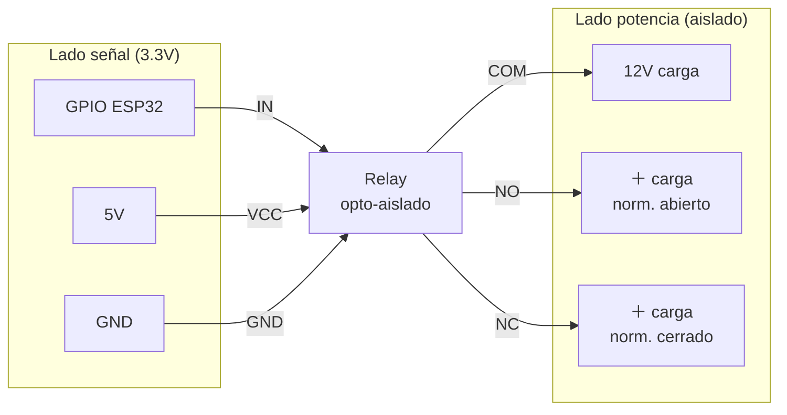

# Módulo Relay 5V con Optoacoplador

Módulo genérico común en kits - sin fabricante único. Disponibles en AliExpress / Amazon en presentaciones de 1, 2, 4, 8 canales.

## Specs típicas

| Spec | Valor |
|---|---|
| Bobina | 5V (algunos 3.3V) |
| Aislamiento | Optoacoplador (típicamente PC817) |
| Capacidad contactos | 10A 250VAC / 10A 30VDC |
| Control | GPIO de microcontrolador (puede ser HIGH o LOW trigger) |

## Diagrama típico

## Por qué optoacoplador

Un LED + fototransistor adentro del módulo transmite la señal de control **ópticamente**, sin contacto eléctrico. Esto significa:

- Picos de tensión de la bobina del relay **no pueden volver al ESP32**
- El ESP32 está físicamente aislado de los 12V (o 220V) de la carga

## Trigger HIGH vs LOW

Algunos módulos chinos activan con LOW (lógica invertida). Verificar el silkscreen o probar con un LED en el GPIO:

## Trampa con cargas inductivas

> ⚠️ Para cargas inductivas (bobinas, motores, electroválvulas), **incluso con relay optoacoplado**, agregar diodo flyback [1N4007](../diodos/1n4007.md) en paralelo con la bobina de la carga (no la del relay - esa ya viene protegida en el módulo).

Sin esto, los contactos del relay se sueldan por arco eléctrico tras unos cientos de conmutaciones.
