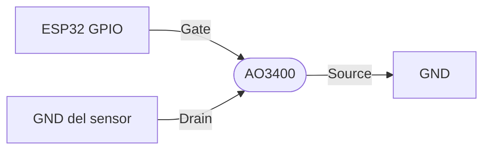

# AO3400

MOSFET N-channel SMD, logic-level. Versión compacta para cargas medias.

Datasheet: [Alpha & Omega AO3400 (PDF)](https://aosmd.com/pdfs/datasheet/AO3400.pdf)

## Specs

| Spec | Valor |
|---|---|
| Tipo | MOSFET N-channel |
| Corriente max (I_D) | 5.8 A @ TA=$25\,^\circ\text{C}$ (4.9 A @ TA=$70\,^\circ\text{C}$) |
| Tensión máx Vds | 30V |
| Vgs(th) | 0.65-1.45V (logic-level - se satura con 4.5V) |
| Rds(on) | ~$18\,\text{m}\Omega$ típ @ Vgs=10V ($\leq 28\,\text{m}\Omega$ máx); $\leq 33\,\text{m}\Omega$ @ Vgs=4.5V |
| Package | SOT-23 (SMD) |

## Cuándo elegirlo

- Cargas SMD (en PCB diseñada) donde no entra un TO-220
- Conmutación de señales lógicas a media corriente
- Power gating de sensores: cortar VDD para que el sensor no consuma en deep sleep

## Circuito típico - power gating

GPIO HIGH → MOSFET conduce → sensor alimentado. GPIO LOW → MOSFET corta → sensor sin GND, no consume.

(Esto es low-side power gating; para high-side se usa MOSFET P-channel.)
