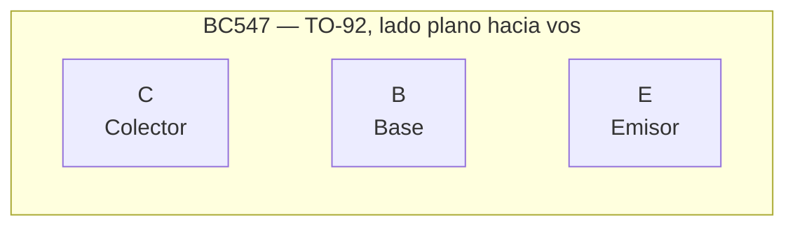

# BC547

Transistor NPN bipolar de baja potencia, muy común en electrónica de señal.

Datasheet típico: [BC547 (PDF)](https://www.onsemi.com/pdf/datasheet/bc550-d.pdf) (familia BC546/547/548/549/550)

## Specs

| Spec | Valor |
|---|---|
| Tipo | NPN |
| Corriente max (I_C) | 100 mA |
| Tensión máx Vce | 45V |
| Hfe (β) | 110-800 (clase A: 110-220, B: 200-450, C: 420-800) |
| Vbe(sat) | ~0.7V |
| Package | TO-92 |

## Pinout (lado plano hacia vos)

## Casos de uso típicos

- Señales digitales / amplificación de pequeña señal
- Drivers de LED hasta 100 mA
- Para corrientes mayores usar [2N2222](./2n2222.md), [BC337](./bc337.md) o [S8050](./s8050.md)

## Complementario PNP

[BC557](./bc557.md) - mismas specs en PNP.
