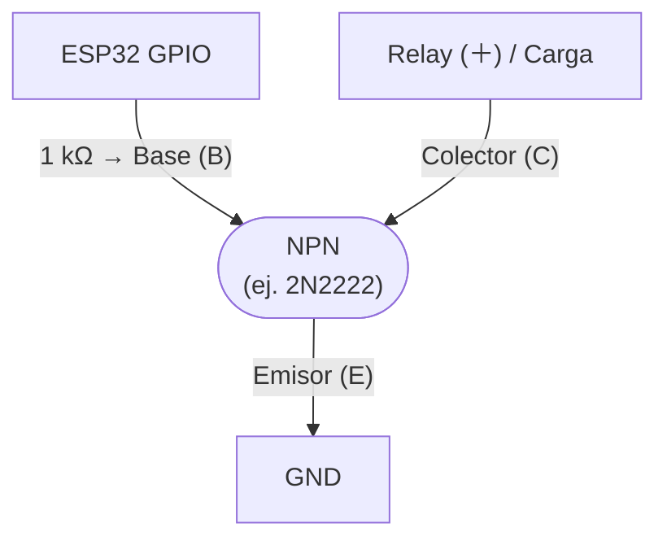

# Transistores

Conmutadores/amplificadores para manejar cargas que superan los **~20 mA** del GPIO de un ESP32 (default drive strength; 40 mA absolute max per [datasheet Tabla 5-3](https://www.espressif.com/sites/default/files/documentation/esp32_datasheet_en.pdf)). Ejemplos típicos: relays mecánicos, LEDs de potencia, bobinas inductivas.

## NPN - corriente fluye de Colector a Emisor cuando Base está en HIGH

| Modelo | Corriente max | Uso principal |
|---|---|---|
| [2N2222](./2n2222.md) | 600 mA | Relays, LEDs, señales generales |
| [BC547](./bc547.md) | 100 mA | Señales, LEDs, cargas chicas |
| [S9013](./s9013.md) | 500 mA | Similar a 2N2222 |
| [BC337](./bc337.md) | 800 mA | Relays medianos |
| [S8050](./s8050.md) | 700 mA | Cargas medianas |

## PNP - lógica inversa: HIGH en base = transistor apagado

| Modelo | Corriente max | Complementario de |
|---|---|---|
| [BC327](./bc327.md) | 800 mA | [BC337](./bc337.md) |
| [BC557](./bc557.md) | 100 mA | [BC547](./bc547.md) |
| [S9012](./s9012.md) | 500 mA | [S9013](./s9013.md) |

## MOSFETs (corrientes >1 A)

| Modelo | Tipo | Corriente max | Uso |
|---|---|---|---|
| [IRLZ44N](./irlz44n.md) | N-channel, logic-level | ~50 A | Motores DC, calefactores, LEDs de potencia |
| [AO3400](./ao3400.md) | N-channel, SMD | ~5.7 A | SMD compacto |

## Darlington (alternativa legacy a MOSFET)

| Modelo | Corriente max | Notas |
|---|---|---|
| [TIP120](./tip120.md) | 5 A | $V_{CE(sat)} = 2\,\text{V}$ max @ 3A, $4\,\text{V}$ max @ 5A ([datasheet onsemi](https://www.onsemi.com/pdf/datasheet/tip120-d.pdf)) - mucho menos eficiente que MOSFET |

## Circuito típico NPN para manejar relay desde ESP32

> ⚠️ **Siempre agregar diodo flyback [1N4007](../diodos/1n4007.md)** en paralelo con la bobina del relay.

## Identificación de patas (TO-92)

Mirando el lado plano del transistor con las patas hacia abajo, el orden de pines varía según modelo. **Siempre verificar contra el datasheet** del modelo específico - equivocarse fríe el transistor en milisegundos.
