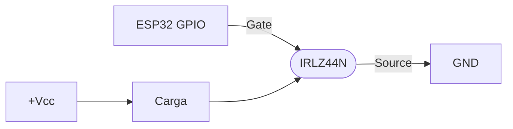

# IRLZ44N

MOSFET N-channel logic-level - apto para conmutar grandes corrientes con señal de 3.3V o 5V.

Datasheet: [Infineon IRLZ44N (PDF)](https://www.infineon.com/dgdl/Infineon-IRLZ44N-DataSheet-v01_01-EN.pdf)

## Specs

| Spec | Valor |
|---|---|
| Tipo | MOSFET N-channel |
| Corriente max (I_D) | 47 A continuos @ TC=$25\,^\circ\text{C}$ (33 A @ TC=$100\,^\circ\text{C}$) |
| Tensión máx Vds | 55V |
| Vgs(th) | 1.0-2.0V (logic-level - se satura con 3.3V o 5V) |
| Rds(on) | $22\,\text{m}\Omega$ máx @ Vgs=10V ($25\,\text{m}\Omega$ @ Vgs=5V) |
| Package | TO-220 |

## Cuándo elegirlo

- Cargas > 1A (motores DC, calefactores, LEDs de potencia, electroválvulas grandes)
- Conmutación directa desde GPIO ESP32 (3.3V activa el gate completamente)

## Circuito típico

> Para gate de alta velocidad (PWM > 10 kHz), agregar resistor $100\,\Omega$ en serie al gate + pull-down $10\,\text{k}\Omega$. Para cargas inductivas, diodo flyback (Schottky tipo [1N5822](../diodos/1n5822.md)) en antiparalelo con la carga.

## Vs Darlington TIP120

[IRLZ44N](./irlz44n.md): $R_{DS(on)} = 22\,\text{m}\Omega$ max → a 1 A disipa solo $1^2 \cdot 0.022 = 22\,\text{mW}$ ([verificado en datasheet Infineon](https://www.infineon.com/dgdl/Infineon-IRLZ44N-DataSheet-v01_01-EN.pdf), Electrical Characteristics).

[TIP120](./tip120.md): $V_{CE(sat)} = 2\,\text{V}$ max @ 3 A, $4\,\text{V}$ max @ 5 A ([datasheet onsemi](https://www.onsemi.com/pdf/datasheet/tip120-d.pdf)). A 1 A la curva indica ~1 V → ~1 W disipados solo en el transistor. La diferencia crece con la corriente: a 5 A, el MOSFET disipa 0.55 W vs ~20 W del TIP120.

**Para cargas >1 A, MOSFET es preferible** por eficiencia y disipación.
