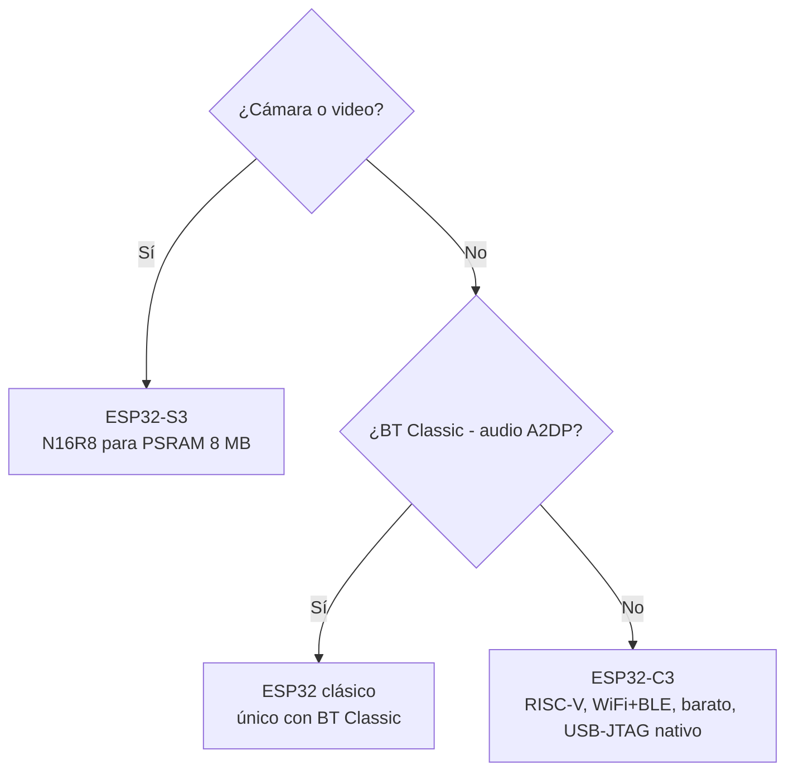

## Árbol de decisión rápido

### ¿Qué chip uso?

### ¿Qué DevKit compro?

Recomendaciones por caso de uso típico:

| Caso                                                               | DevKit típico                                                                                                                    |
| ------------------------------------------------------------------ | -------------------------------------------------------------------------------------------------------------------------------- |
| Cámara o nodo de referencia con muchos sensores                    | [ESP32-S3-DevKitC-1](devkits/espressif/esp32-s3-devkitc-1.md) **N16R8**                                                          |
| Nodo sensor / actuador / análisis de suelo (WiFi + GPIO + I2C/ADC) | [ESP32-C3-DevKitC-02](devkits/espressif/esp32-c3-devkitc-02.md)                                                                  |
| Dispositivo Matter / Thread / Zigbee                               | [ESP32-C6-DevKitC-1](devkits/espressif/esp32-c6-devkitc-1.md) o [ESP32-H2-DevKitM-1](devkits/espressif/esp32-h2-devkitm-1.md)    |
| Audio Bluetooth Classic (A2DP)                                     | ESP32 clásico (no documentado en este repo, ver [Fatal Fury ESP32](../seguridad-iot/fatal-fury-esp32.md)) |

Detalle de variantes y trampas en [`devkits.md`](./devkits.md).
