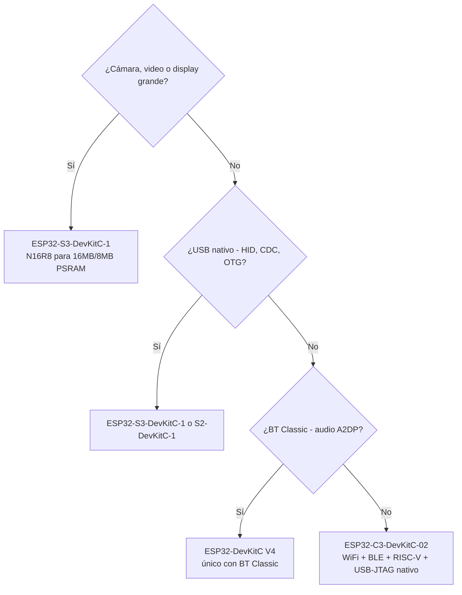

# DevKits - Overview y Árbol de Decisión

> Los modelos individuales por fabricante están en [`devkits/`](./devkits/index.md). Esta página es el "cómo elijo".

## Nomenclatura

| Sufijo       | Significa                                                                                                                               |
| ------------ | --------------------------------------------------------------------------------------------------------------------------------------- |
| `DevKitC`    | Módulo de footprint estándar (mayor). Usa módulo [WROOM](modulos/wroom.md) en S3/C3/C5/C6/H2, o módulo [SOLO](modulos/solo.md) en S2. Más GPIO accesibles. |
| `DevKitM`    | Módulo MINI (footprint reducido, menos pines).                                                            |
| `-1`, `-02`  | Número de revisión de la placa, no del módulo                                                                                          |
| `Native USB` | USB directo al periférico USB del SoC. Placa puede ser HID, CDC, OTG.                                                                   |
| `Bridge USB` | Chip USB-to-UART (CP2102, CH340, FTDI). Solo flashear y monitor serie.                                                                  |

---

## Árbol de decisión

---

## Qué DevKit típicamente sirve para cada tarea

Recomendaciones por caso de uso. La decisión final depende del proyecto.

| Necesidad                                                       | DevKit típico                                                                                                     | Por qué                                                                               |
| --------------------------------------------------------------- | ----------------------------------------------------------------------------------------------------------------- | ------------------------------------------------------------------------------------- |
| Cámara o frame buffer grande                                    | **[ESP32-S3-DevKitC-1 N16R8](devkits/espressif/esp32-s3-devkitc-1.md)**                                                     | 8 MB PSRAM para frame buffer, interfaz DVP/MIPI integrada (único con interfaz cámara) |
| Integrar muchos sensores I2C + buffer largo                     | **[ESP32-S3-DevKitC-1](devkits/espressif/esp32-s3-devkitc-1.md)**                                                           | Heap grande + PSRAM si querés guardar lecturas en caso de caída de red                |
| Nodo sensor sencillo (1-3 sensores I2C/UART)                    | **[ESP32-C3-DevKitC-02](devkits/espressif/esp32-c3-devkitc-02.md)**                                                         | WiFi + I2C + UART alcanza,                                                            |
| Actuador on/off (relay, válvula)                                | **[ESP32-C3-DevKitC-02](devkits/espressif/esp32-c3-devkitc-02.md)**                                                         | Sólo necesita WiFi + GPIO digital                                                     |
| Lectura de sensores analógicos (capacitivo de suelo, NTC, etc.) | **[ESP32-C3-DevKitC-02](devkits/espressif/esp32-c3-devkitc-02.md)**                                                         | 6 canales ADC, sin la restricción de ADC2/WiFi del ESP32 clásico                      |
| Dispositivo Matter/Thread/Zigbee                                | **[ESP32-C6-DevKitC-1](devkits/espressif/esp32-c6-devkitc-1.md)** o **[ESP32-H2-DevKitM-1](devkits/espressif/esp32-h2-devkitm-1.md)** | Único con 802.15.4 + WiFi 6 (C6) o 802.15.4                                           |

---

## Trampas comunes

- **AI Thinker ESP32-CAM**: no tiene USB, requiere adaptador FTDI externo. La cámara más barata del mercado, pero asume que ya tenés un adaptador.
- **ESP-WROVER-KIT V4**: DevKit basado en el ESP32 clásico (no documentado, ver [Fatal Fury](../seguridad-iot/fatal-fury-esp32.md)). En diseños nuevos, [ESP32-S3](socs/esp32-s3.md) con USB Serial/JTAG nativo cubre el mismo caso de uso sin hardware extra.
- **Adafruit S3 [Feather](form-factors.md)**: tiene 4+ SKUs distintos con configuraciones de memoria diferentes. Verificar el SKU exacto antes de comprar.
- **[STEMMA QT](conectores.md) $\neq$ STEMMA**: son dos estándares de Adafruit con nombres similares. [STEMMA QT](conectores.md) es Qwiic-compatible (JST SH 1.0mm). STEMMA grande es JST PH 2.0mm. No son intercambiables.
