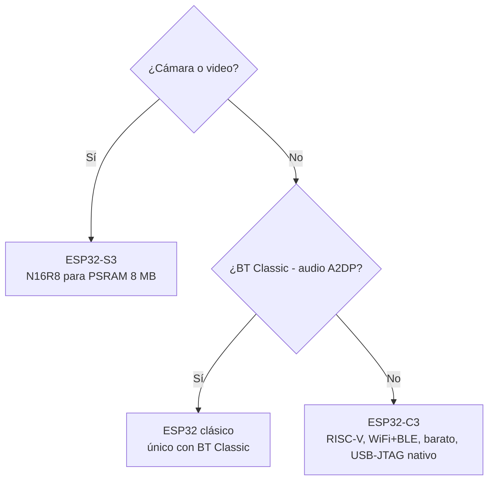

# Hardware ESP32

Hardware = chips, módulos, boards, conectores y frameworks.

## Lecturas en orden

| # | Archivo | Cuándo |
|---|---|---|
| 1 | [`arquitecturas-cpu.md`](./arquitecturas-cpu.md) | Antes de elegir chip - Xtensa vs RISC-V, qué implica para tu debug/build |
| 2 | [`socs/`](./socs/index.md) | Catálogo de chips (Brain). Un archivo por chip. |
| 3 | [`modulos/`](./modulos/index.md) | [WROOM](modulos/wroom.md) / [MINI](modulos/mini.md) / [SOLO](modulos/solo.md) / [WROVER](modulos/wrover.md), decoding de part numbers |
| 4 | [`devkits.md`](./devkits.md) | Overview de DevKits + árbol de decisión |
| 5 | [`devkits/`](./devkits/index.md) | Catálogo completo por fabricante (un archivo por DevKit) |
| 6 | [`conectores.md`](./conectores.md) | [Qwiic](conectores.md), [STEMMA QT](conectores.md), [Grove](conectores.md) - conectar sensores sin soldar |
| 7 | [`form-factors.md`](./form-factors.md) | [Feather](form-factors.md), [XIAO](form-factors.md), [D1 Mini](form-factors.md), [M5Stack](form-factors.md) |
| 8 | [`frameworks/`](./frameworks/index.md) | Un archivo por framework: [ESP-IDF](frameworks/esp-idf.md), [Arduino](frameworks/arduino.md), [PlatformIO](frameworks/platformio.md), [Rust](frameworks/rust.md) (std + no_std + [Embassy](https://github.com/embassy-rs/embassy)), [ESPHome](frameworks/esphome.md) |
| 9 | [`migracion-esp8266.md`](./migracion-esp8266.md) | Si venís del [ESP8266](migracion-esp8266.md) |

## Árbol de decisión rápido

### ¿Qué chip uso?

### ¿Qué DevKit compro?

Recomendaciones por caso de uso típico:

| Caso | DevKit típico |
|---|---|
| Cámara o nodo de referencia con muchos sensores | [ESP32-S3-DevKitC-1](devkits/espressif/esp32-s3-devkitc-1.md) **N16R8** |
| Nodo sensor / actuador / análisis de suelo (WiFi + GPIO + I2C/ADC) | [ESP32-C3-DevKitC-02](devkits/espressif/esp32-c3-devkitc-02.md) |
| Dispositivo Matter / Thread / Zigbee | [ESP32-C6-DevKitC-1](devkits/espressif/esp32-c6-devkitc-1.md) o [ESP32-H2-DevKitM-1](devkits/espressif/esp32-h2-devkitm-1.md) |
| Audio Bluetooth Classic (A2DP) | ESP32 clásico (no documentado en este repo - ver [`../seguridad-iot/fatal-fury-esp32.md`](../seguridad-iot/fatal-fury-esp32.md)) |

Detalle de variantes y trampas en [`devkits.md`](./devkits.md).
