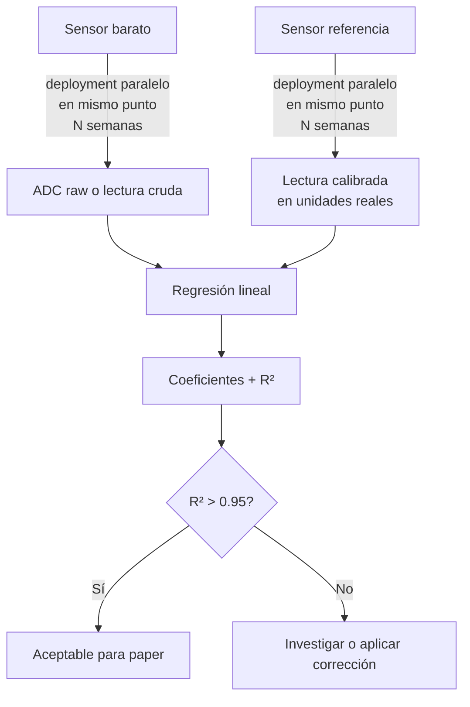

# Calibración Cruzada

## Qué es

Comparar lecturas paralelas de un sensor barato con un sensor calibrado (referencia) durante una ventana suficientemente larga, en condiciones reales del experimento. Resultado: una correlación cuantitativa ($R^2$) y opcionalmente una ecuación de corrección.



---

## Protocolo paso a paso

### 1. Setup

- Instalar **sensor de referencia** y **sensor de control** lo más cerca posible (< 30 cm)
- Misma altura, mismo entorno (sombra/exposición), mismo sustrato si es suelo
- Sincronizar relojes de ambos nodos (SNTP, mismo NTP server)
- Verificar que ambos publican al broker con timestamps consistentes

### 2. Duración mínima

| Variable                                   | Ventana mínima                                       | Por qué                                                           |
| ------------------------------------------ | ---------------------------------------------------- | ----------------------------------------------------------------- |
| Temp + HR aire                             | 2 semanas                                            | Captura ciclos día/noche y variabilidad diaria                    |
| CO2                                        | 4 semanas                                            | CO2 cambia lento, muchos puntos son necesarios para significancia |
| [PAR](../sensores/luz/conceptos-par.md) | 2 semanas con días soleados Y nublados               | Variabilidad de espectro                                          |
| [VWC](../sensores/humedad-suelo/vwc.md) | 2-4 semanas con al menos 2 ciclos de riego completos | Ciclos seco $\rightarrow$ saturado $\rightarrow$ drenaje          |
| pH                                         | 4 semanas                                            | pH del suelo cambia lento                                         |

### 3. Recolección

Almacenar en [InfluxDB](../conectividad/mqtt-stack.md):

```
greenhouse/zone-A/sht40/data ← control
greenhouse/reference/sht45/data ← referencia
```

Query típica:

```sql
SELECT mean("temp_c")
FROM "sht40"
WHERE time > now - 14d
GROUP BY time(1m)
```

Exportar a CSV vía CLI:

```bash
influx query 'from(bucket: "sensors") |> range(start: -14d) ...' \
 --raw > control_temp.csv
```

### 4. Análisis estadístico

En Python:

```python
import pandas as pd
import numpy as np
from sklearn.linear_model import LinearRegression
from sklearn.metrics import r2_score

control = pd.read_csv("control_temp.csv", parse_dates=["time"])
ref = pd.read_csv("ref_temp.csv", parse_dates=["time"])

merged = pd.merge_asof(
 control.sort_values("time"),
 ref.sort_values("time"),
 on="time", direction="nearest",
 tolerance=pd.Timedelta("1min"),
 suffixes=("_control", "_ref"),
).dropna

X = merged[["temp_c_control"]].values
y = merged["temp_c_ref"].values

model = LinearRegression.fit(X, y)
y_pred = model.predict(X)
r2 = r2_score(y, y_pred)

print(f"R² = {r2:.4f}")
print(f"Slope = {model.coef_[0]:.4f}")
print(f"Intercept = {model.intercept_:.4f}")
```

### 5. Criterios de aceptación

| $R^2$ obtenido | Decisión                                                                                                                                   |
| -------------- | ------------------------------------------------------------------------------------------------------------------------------------------ |
| > 0.95         | Validación aceptada - usar lecturas del control directamente                                                                               |
| 0.85 - 0.95    | Aplicar corrección lineal: $\text{valor_corregido} = \text{slope} \cdot \text{valor_control} + \text{intercept}$. Reportar en metodología. |
| 0.75 - 0.85    | Investigar: sensor mal posicionado, sustrato diferente, electrodo dañado. Repetir setup.                                                   |
| < 0.75         | Sensor no apto. Reemplazar o cambiar de tecnología.                                                                                        |

### 6. Reporte en el paper

Para cada par sensor-control / sensor-referencia, reportar:

- Número de mediciones paralelas (n)
- Período de comparación (dd/mm/yyyy a dd/mm/yyyy)
- $R^2$ obtenido
- Slope e intercept de la regresión lineal
- RMSE en unidades físicas

Ejemplo:

> "Air temperature: [SHT40](../sensores/temperatura-humedad/sht40.md) vs [SHT45](../sensores/temperatura-humedad/sht45.md) paired deployment, n=20,160 (2 weeks at 1-min intervals), $R^2 = 0.987$, slope = 0.998, intercept = $0.14\,°\text{C}$, RMSE = $0.21\,°\text{C}$."

---

## Rotación del TEROS 11

Como el [TEROS 11](../sensores/humedad-suelo/teros-11.md) es la pieza más cara, no hay uno por nodo. **Se rota** entre zonas:

| Semana | [TEROS 11](../sensores/humedad-suelo/teros-11.md) ubicado en | Capacitivo validado |
| ------ | --------------------------------------------------------------- | ------------------- |
| 1-2    | Zona A                                                          | Capacitivo A        |
| 3-4    | Zona B                                                          | Capacitivo B        |
| 5-6    | Zona C                                                          | Capacitivo C        |
| 7-8    | Zona D                                                          | Capacitivo D        |

Cada rotación genera un par de series temporales paralelas. Al final del experimento tenés $R^2$ por zona.

---

## Outliers - cómo manejarlos

Lecturas anómalas pueden venir de:

- **Falla transitoria del sensor** (pérdida de contacto, condensación momentánea)
- **Evento real extremo** (riego no programado, planta caída sobre el sensor)
- **Falla del nodo** (boot reset, falla I2C)
- **Atacante inyectando datos** (si la seguridad [MQTT](../conectividad/mqtt-stack.md) no está bien - ver [`../seguridad-iot/`](../seguridad-iot/))

Protocolo:

1. **Detección automática**: lecturas que se desvían > 3σ del promedio móvil de 1h
2. **Marcar pero no eliminar** automáticamente - guardar como flag, no como missing
3. **Revisión manual** semanal del log de outliers contra eventos del log de intervenciones
4. **Reportar en el paper** cuántos outliers se excluyeron y por qué

```python
df["rolling_mean"] = df["value"].rolling(window=60).mean
df["rolling_std"] = df["value"].rolling(window=60).std
df["outlier"] = abs(df["value"] - df["rolling_mean"]) > 3 * df["rolling_std"]
```

---

## Drift temporal

Los sensores derivan en el tiempo. Para detectarlo:

1. **Pre-experimento:** medir cross-calibration. $R^2$ inicial.
2. **Post-experimento:** medir cross-calibration nuevamente. $R^2$ final.
3. Si $R^2_{\text{final}} < R^2_{\text{inicial}} - 0.02$, hay drift. Reportar en limitaciones del paper.

Drift típico por sensor:

| Sensor                                                                 | Drift esperado                                        |
| ---------------------------------------------------------------------- | ----------------------------------------------------- |
| [SHT45](../sensores/temperatura-humedad/sht45.md) (con filtro PTFE) | < $0.5\,°\text{C}$ / año                              |
| [SHT40](../sensores/temperatura-humedad/sht40.md)                   | ~1-2% RH / año                                        |
| [MH-Z19B](../sensores/co2/mh-z19b.md) (ABC off)                     | ~5% / año - requiere recalibración manual             |
| [SCD41](../sensores/co2/scd41.md)                                   | ~50 ppm / año                                         |
| [BH1750](../sensores/luz/bh1750.md)                                 | ~5% / año                                             |
| [AS7341](../sensores/luz/as7341.md)                                 | ~1-2% / año                                           |
| Capacitivo suelo                                                       | 1-2% [VWC](../sensores/humedad-suelo/vwc.md) / año |
| [TEROS 11](../sensores/humedad-suelo/teros-11.md)                   | < 1% / 5 años (factory cal)                           |
| Atlas [EZO-pH](../sensores/ph-suelo/ezo-ph.md)                      | ~0.1 pH / 4 semanas - recalibrar                      |
