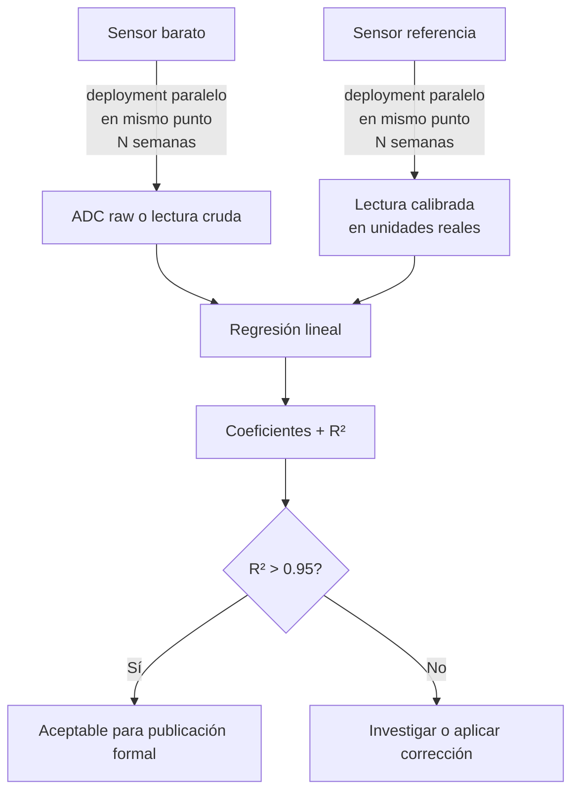

> [!warning] Work In Progress
> Esta sección está en construcción y pendiente de revisión y cambios.

# Calibración Cruzada

## Qué es

Comparar lecturas paralelas de un sensor barato con un sensor calibrado (referencia) durante una ventana suficientemente larga, en condiciones reales del experimento. Resultado: una correlación cuantitativa ([$R^2$](./conceptos/r-cuadrado.md)) y opcionalmente una ecuación de corrección.

---

## Drift temporal

Los sensores derivan en el tiempo. Para detectarlo:

1. **Pre-experimento:** medir cross-calibration. $R^2$ inicial.
2. **Post-experimento:** medir cross-calibration nuevamente. $R^2$ final.
3. Si $R^2_{\text{final}} < R^2_{\text{inicial}} - 0.02$, hay drift. 

[^mhz19b]: El datasheet de Winsen (v1.0) no especifica drift temporal. La precisión declarada es ±(50 ppm + 3% del valor leído) y la vida útil > 5 años. El ABC (autocorrección automática) asume 400 ppm como baseline y el fabricante lo declara explícitamente no apto para invernadero/granja (el ABC, no el sensor en si! Ver página 9 del datasheet, sección "8. ZERO point calibration", bajo "ABC logic function"). Ver [mhz19b](../sensores/co2/mh-z19b.md) para ver como desactivar el ABC

[^sht45drift]: Sensirion SHT4x Datasheet v6.4 (Nov 2023), sección 2.2 "Temperature", Table 2, fila "Long-term drift". Disponible en [sensirion.com/resource/datasheet/sht4x](https://sensirion.com/resource/datasheet/sht4x).

[^sht40drift]: Sensirion SHT4x Datasheet v6.4 (Nov 2023), sección 2.1 "Relative Humidity", Table 1, fila "Long-term drift". Mismo documento que [^sht45drift].

[^scd41drift]: Sensirion SCD4x Datasheet v1.7 (Apr 2025), sección 1.1 "CO2 Sensing Performance", Table 1, fila "Additional accuracy drift per year, starting after five years". El drift solo aplica a partir del quinto año de operación continua. Disponible en [sensirion.com/resource/datasheet/scd4x](https://sensirion.com/resource/datasheet/scd4x).
