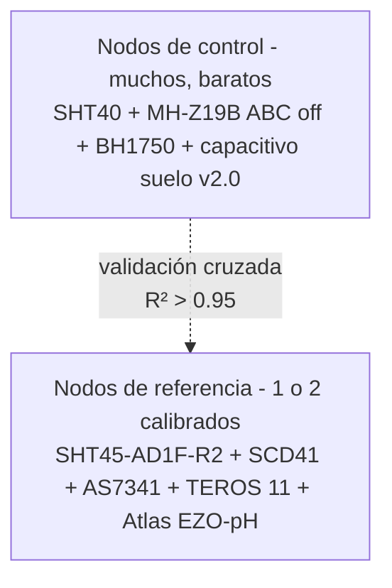

# Metodología

## Arquitectura de dos capas

### Por qué dos capas

- Cobertura espacial $\rightarrow$ muchos nodos baratos
- Precisión académica $\rightarrow$ pocos nodos calibrados
- Validación cruzada documentada $\rightarrow$ reviewers aceptan los datos de los nodos baratos

### Costo vs precisión

| Aspecto | Solo nodos caros | Solo nodos baratos | Dos capas ✅ |
|---|---|---|---|
| Costo | Prohibitivo a 10+ puntos | Bajo | Medio |
| Cobertura espacial | Limitada (~1-2 puntos) | Excelente | Excelente |
| Validez para paper | ✅ directa | Cuestionable | ✅ con validación documentada |
| Riesgo si se rompe uno | Pierdes todo | Pierdes un punto | Si rompiste un control, los demás cubren; si rompiste el referencia, mantenés la cobertura |

---

## Variables del experimento

| Variable | Unidad | Frecuencia | Sensor control | Sensor referencia |
|---|---|---|---|---|
| Temperatura aire | $^\circ\text{C}$ | 1/min | [SHT40](../sensores/temperatura-humedad/sht40.md) | [SHT45-AD1F-R2](../sensores/temperatura-humedad/sht45.md) |
| Humedad relativa aire | % | 1/min | [SHT40](../sensores/temperatura-humedad/sht40.md) | [SHT45-AD1F-R2](../sensores/temperatura-humedad/sht45.md) |
| CO2 | ppm | 1/min | [MH-Z19B](../sensores/co2/mh-z19b.md) (ABC off) | [SCD41](../sensores/co2/scd41.md) |
| [PAR](../sensores/luz/conceptos-par.md) / [PPFD](../sensores/luz/conceptos-par.md) | $\mu\text{mol}/\text{m}^2/\text{s}$ | 1/min | [BH1750](../sensores/luz/bh1750.md) + caveat | [AS7341](../sensores/luz/as7341.md) calibrado |
| [NDVI](../sensores/luz/conceptos-par.md) | adimensional | 1/15min | ❌ | [AS7341](../sensores/luz/as7341.md) (NIR + F7) |
| [VWC](../sensores/humedad-suelo/vwc.md) suelo | % | 1/15min | Capacitivo v2.0 calibrado | [TEROS 11](../sensores/humedad-suelo/teros-11.md) |
| Temperatura suelo | $^\circ\text{C}$ | 1/15min | ❌ | [TEROS 11](../sensores/humedad-suelo/teros-11.md) |
| EC suelo | dS/m | 1/15min | ❌ | TEROS 12 (no incluido en este proyecto) - el [TEROS 11](../sensores/humedad-suelo/teros-11.md) no mide EC |
| pH suelo | pH | **1/semana (muestreo ex-situ)** | ❌ | Atlas [EZO-pH](../sensores/ph-suelo/ezo-ph.md) - muestreo periódico con protocolo suelo:agua (ver [`ph-suelo/README.md`](../sensores/ph-suelo/index.md)). La medición continua in-situ no es metodológicamente válida. |

---

## Procedimiento experimental

### Pre-deployment (1-2 semanas antes)

1. Calibración de sensores capacitivos para el sustrato del experimento (procedimiento gravimétrico, ver [`../sensores/vwc.md`](../sensores/humedad-suelo/vwc.md))
2. Desactivación de ABC en cada [MH-Z19B](../sensores/co2/mh-z19b.md) vía UART
3. Calibración 3-puntos del electrodo [EZO-pH](../sensores/ph-suelo/ezo-ph.md) con buffers NIST-traceable
4. Calibración multilineal del [AS7341](../sensores/luz/as7341.md) contra [Apogee SQ-500](../sensores/luz/apogee-sq-500.md) en condiciones reales del invernadero
5. Cross-deployment 1 semana entre nodo de control y nodo de referencia en la misma posición - registrar $R^2$ inicial

### Durante el experimento

- Lecturas continuas según frecuencia tabla anterior
- Heartbeat cada minuto de cada nodo
- Backup diario de InfluxDB en ubicación física separada
- Recalibración de [EZO-pH](../sensores/ph-suelo/ezo-ph.md) cada 4 semanas
- Inspección visual de los nodos (humedad, suciedad, plantas tapando sensores) cada 2 semanas
- Rotación del [TEROS 11](../sensores/humedad-suelo/teros-11.md) entre zonas cada 2 semanas para validar todos los capacitivos

### Post-experimento

- Recalibración final de capacitivos en mismo sustrato + condiciones, registrar drift
- Cálculo de $R^2$ final entre nodos de control y referencia
- Identificación de outliers y eventos atípicos (cortes de luz, eventos climáticos, intervenciones humanas)

---

## Texto sugerido para sección "Materials and Methods"

> "A two-tier sensor network was deployed in a greenhouse comprising 12 low-cost control nodes for spatial coverage and 2 reference nodes for calibration validation. Control nodes (n=12) were based on [ESP32-C6](../hardware-esp32/socs/esp32-c6.md) microcontrollers (Espressif Systems) reading [SHT40](../sensores/temperatura-humedad/sht40.md) air temperature/humidity sensors (Sensirion AG), [MH-Z19B](../sensores/co2/mh-z19b.md) NDIR CO2 sensors (Winsen Electronics) with Automatic Baseline Correction (ABC) disabled, [BH1750](../sensores/luz/bh1750.md) light sensors (Rohm), and capacitive soil moisture sensors (v2.0, resistive-corrosion-resistant). Reference nodes (n=2) were based on [ESP32-S3](../hardware-esp32/socs/esp32-s3.md) microcontrollers (Espressif Systems) reading [SHT45-AD1F-R2](../sensores/temperatura-humedad/sht45.md) sensors with integrated PTFE filter (Sensirion AG, $\pm 0.1\,^\circ\text{C}$, $\pm 1\%$ RH), [SCD41](../sensores/co2/scd41.md) photoacoustic NDIR CO2 sensors (Sensirion AG, $\pm 40\,\text{ppm}$), [AS7341](../sensores/luz/as7341.md) 11-channel spectral sensors ([ams-OSRAM](../sensores/luz/as7341.md)) calibrated against an [Apogee SQ-500SS](../sensores/luz/apogee-sq-500.md) quantum sensor ([Apogee Instruments](../sensores/luz/apogee-sq-500.md), NIST-traceable), [METER TEROS 11](../sensores/humedad-suelo/teros-11.md) soil sensors (METER Group, factory-calibrated SDI-12 [VWC](../sensores/humedad-suelo/vwc.md) + temperature output). Soil pH was measured separately via periodic ex-situ sampling (weekly) following [ASTM D4972](https://www.astm.org/d4972-19.html) (1:2.5 soil:water suspension) using an [Atlas Scientific EZO-pH](../sensores/ph-suelo/ezo-ph.md) circuit with laboratory-grade BNC electrode (3-point NIST-traceable calibration before each session). Continuous in-situ measurement of soil pH was excluded as methodologically unreliable. Data from continuous sensors was published via MQTT (TLS-encrypted, mutually authenticated) to a local Mosquitto broker and stored in InfluxDB; pH spot measurements were entered manually with metadata (sample timestamp, soil:water ratio, electrode slope). Low-cost capacitive soil moisture sensors were calibrated gravimetrically for each substrate type by fitting a second-order polynomial regression ($R^2 > 0.98$) and cross-validated against [TEROS 11](../sensores/humedad-suelo/teros-11.md) reference sensors over 2-week paired deployments ($R^2 > 0.95$ between sensor types)."

---

## Eventos a documentar

Cualquier intervención humana o evento atípico se registra en un log separado:

- Inicio/fin del experimento
- Recalibraciones (qué sensor, qué buffer, slope antes/después)
- Reemplazo de sensores
- Reflasheo de firmware (versión nueva, motivo)
- Eventos climáticos extremos
- Intervenciones de riego manual (fuera del control automatizado)
- Cortes de luz
- Mantenimiento del invernadero (poda, fumigación)

Este log se cita en el paper como "eventos excluidos del análisis" o se procesa por separado.
