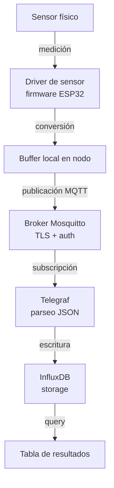

> [!warning] Work In Progress
> Esta sección está en construcción y pendiente de revisión y cambios.

# Trazabilidad - Qué Pide un Reviewer

## La pregunta de fondo

> *"¿Cómo sé que tus lecturas son verdad?"*

Un reviewer no puede ir físicamente al sitio de medición a verificar. Tiene que confiar en que:

1. **El sensor es lo que decís que es** (no un clon mal calibrado)
2. **Está calibrado contra algo trazable** (no contra "lo que indica mi otro sensor barato")
3. **El procedimiento es reproducible** (otro grupo podría repetir tu experimento)
4. **Los datos no fueron manipulados** (cadena de custodia desde el sensor hasta la tabla de resultados)

---

## Trazabilidad por sensor

### Sensores con cadena trazable directa

| Sensor | Calibración trazable a |
|---|---|
| [SHT45-AD1F-R2](../sensores/temperatura-humedad/sht45.md) (Sensirion) | NIST + DKD (German Calibration Service) - datasheet documenta proceso |
| [SCD41](../sensores/co2/scd41.md) (Sensirion) | NIST CO2 reference standards |
| [Atlas Scientific EZO-pH](../sensores/ph-suelo/ezo-ph.md) | NIST-traceable buffer solutions (pH 4.01, 7.00, 10.00) |

Para estos sensores, citar el **datasheet del fabricante** + número de modelo exacto es suficiente.

### Sensores SIN cadena trazable directa

| Sensor | Cómo darles trazabilidad |
|---|---|
| [SHT40](../sensores/temperatura-humedad/sht40.md) (sin filtro) | Cross-calibración contra [SHT45](../sensores/temperatura-humedad/sht45.md) |
| [MH-Z19B](../sensores/co2/mh-z19b.md) | Cross-calibración contra [SCD41](../sensores/co2/scd41.md) + ABC off documented |
| [BH1750](../sensores/luz/bh1750.md) | [Inter-sensor validation](./conceptos/inter-sensor-validation.md) contra [AS7341](../sensores/luz/as7341.md), declarar limitaciones con LED de cultivo |
| Capacitivo soil v2.0 | Calibración [gravimétrica](https://es.wikipedia.org/wiki/An%C3%A1lisis_gravim%C3%A9trico) únicamente — sin referencia de campo disponible |

Para estos, si se publica formalmente, se documenta el procedimiento de validación en lugar de asumir precisión nominal.

---

## Trazabilidad de la cadena de datos

En cada paso puede haber pérdida o transformación. Documentar:

| Paso | Qué documentar |
|---|---|
| Driver de sensor | Versión del firmware, fórmula de conversión usada, ej. $T = -45 + 175 \cdot \frac{\text{raw}}{65535}$ |
| Buffer local | Política si broker está caído, max tamaño, política FIFO/LIFO |
| Broker | Versión Mosquitto, config relevante (persistencia, retención) |
| Telegraf | Versión, config de parseo, transformaciones aplicadas |
| InfluxDB | Versión, bucket retention policy, downsampling si lo hay |
| Análisis | Scripts versionados en git, commit hash citado en caso de publicación formal |

---

## Reproducibilidad

Para que otro grupo pueda repetir tu experimento, **publicar como suplemento**:

1. **Lista exacta de hardware** con part numbers (no "[ESP32](../hardware-esp32/socs/index.md)" sino "[ESP32-S3-WROOM-1-N16R8](../hardware-esp32/modulos/wroom.md) + [ESP32-S3-DevKitC-1](../hardware-esp32/devkits/espressif/esp32-s3-devkitc-1.md)")
2. **Firmware open source** en un repositorio (GitHub, Zenodo con DOI permanente)
3. **Scripts de calibración** y procesamiento de datos
4. **Datos raw publicados** (Zenodo, Figshare) - no solo los datos limpios
5. **Procedimiento experimental detallado** con timestamps de cada intervención

---

## Lo que rompe la trazabilidad

| Problema | Por qué importa | Cómo evitar |
|---|---|---|
| Firmware sin versionado | No sabés qué versión recolectó cada dato | Incluir version string en el heartbeat: `fw_version: "0.3.1+a1b2c3"` |
| Cambios de hardware no documentados | "Cambié el sensor en la zona A pero olvidé anotar cuándo" | Log de intervenciones obligatorio, fecha + ID del nodo |
| Reloj del nodo no sincronizado | Timestamps inconsistentes entre nodos | SNTP a NTP confiable, validar drift en heartbeat |
| Datos manuales mezclados con sensorizados | No se sabe si una lectura es del sensor o "anotada a ojo" | Tag explícito en InfluxDB: `source = "auto" / "manual"` |
| Recalibraciones no registradas | Cambio de comportamiento del sensor sin explicación | Tag en log de intervenciones, ID del sensor + slope antes/después |
| Backup de InfluxDB perdido o no verificado | Datos del experimento se pierden por crash de disco | Backup diario + verificación de restauración mensual |

---

## Plantilla del "Materials and Methods" - checklist

Si algún día se publica formalmente, verificar antes de submitear:

- [ ] Modelo exacto y fabricante de cada sensor (part number completo)
- [ ] Referencia al datasheet (URL + fecha de acceso)
- [ ] Procedimiento de calibración descrito para cada sensor barato
- [ ] [$R^2$](./conceptos/r-cuadrado.md) de validación cruzada reportado con n, ventana de tiempo, RMSE
- [ ] Versión del firmware y disponibilidad del código
- [ ] Versión del stack (Mosquitto, InfluxDB, Telegraf, Grafana)
- [ ] Período del experimento con timestamps absolutos
- [ ] Eventos atípicos documentados (cortes de luz, intervenciones)
- [ ] Lista de outliers y criterio de exclusión
- [ ] Limitaciones declaradas (deriva, condiciones extremas no testeadas, etc.)

---

## Lo que NO sirve como argumento de trazabilidad

- "Lo medí con un sensor caro" $\rightarrow$ ¿cuál? ¿calibrado contra qué?
- "El fabricante dice $\pm 0.2\,^\circ\text{C}$" $\rightarrow$ ¿precisión = exactitud? ¿en qué rango? ¿después de cuánto tiempo de uso?
- "Comparé con otro sensor barato" $\rightarrow$ no es referencia, ambos pueden estar mal en la misma dirección
- "Tomé el promedio de muchas mediciones" $\rightarrow$ reduce ruido aleatorio, no error sistemático
- "Funcionó en mi tesis de maestría" $\rightarrow$ cada experimento requiere su propia validación de la cadena
