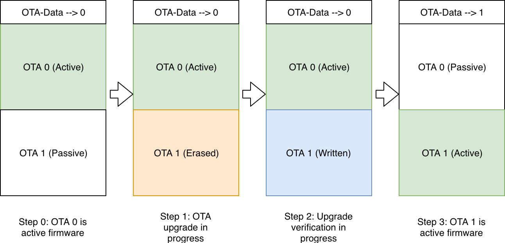

# OTA (Over-The-Air Updates)

OTA es el mecanismo por el cual el ESP32 puede actualizar su propio firmware mientras está corriendo, sin necesidad de acceso físico. La actualización llega por WiFi —o Bluetooth o Ethernet—, se escribe en la flash, y en el siguiente boot el chip corre la nueva versión.[^1]

## El esquema ping-pong

La forma segura de hacer OTA requiere al menos dos particiones de aplicación en la flash: `ota_0` y `ota_1`. El proceso funciona así:[^1]

Mientras el chip corre desde `ota_0`, el nuevo firmware se escribe en `ota_1` (que primero se borra). Solo cuando la escritura termina completa y se verifica, `otadata` se actualiza para indicar que el próximo boot tiene que usar `ota_1`. Si hay un corte de luz en cualquier punto antes de eso, `ota_0` no fue tocado y el chip sigue arrancando normalmente.

`otadata` es una partición pequeña de 8KB que el bootloader lee en cada boot para saber cuál slot es el activo. Si está vacía o corrupta, el bootloader cae a la partición `factory`. La [tabla de particiones](../conceptos/tabla-de-particiones.md) tiene que incluir `ota_0`, `ota_1`, y `otadata` para que todo esto funcione.[^1]

## Rollback de aplicación

El problema con OTA es que el nuevo firmware puede tener un bug que hace que el dispositivo no funcione. Para eso existe el rollback de aplicación.[^1]

El mecanismo funciona con estados. Cuando un nuevo firmware se descarga y se marca como próximo boot, queda en estado `NEW`. En el primer boot, el bootloader lo pasa a `PENDING_VERIFY`. El firmware tiene que confirmarse a sí mismo —tipicamente después de correr algún diagnóstico— llamando a `esp_ota_mark_app_valid_cancel_rollback()`. Si no lo hace antes del siguiente reset, el bootloader interpreta eso como un fallo, marca esa partición como `ABORTED`, y vuelve a la versión anterior.

Si el firmware detecta activamente un error crítico, puede llamar a `esp_ota_mark_app_invalid_rollback_and_reboot()` para iniciar el rollback inmediatamente sin esperar al siguiente reset.

Habilitar este mecanismo requiere `CONFIG_BOOTLOADER_APP_ROLLBACK_ENABLE` en menuconfig. Sin eso, el firmware nuevo se considera válido automáticamente.

## Anti-rollback

El rollback de aplicación resuelve el problema de firmware roto. Pero hay otro vector: un atacante que intercepta un binario viejo, correctamente firmado, puede intentar hacer downgrade del dispositivo a una versión que tiene vulnerabilidades ya corregidas. Secure Boot verifica la firma, no la versión —así que ese binario pasaría la verificación.

Anti-rollback agrega esa verificación de versión. Cada firmware lleva un campo `secure_version` en su header. El bootloader lo compara contra el valor guardado en el eFuse `EFUSE_BLK3_RDATA4_REG` del chip y rechaza cualquier firmware con versión menor.[^1]

Cuando un firmware se confirma como válido con `esp_ota_mark_app_valid_cancel_rollback()`, el sistema actualiza el contador en eFuse. Como los bits de eFuse solo pueden ir de 0 a 1, el contador solo puede subir —rollback de versión queda bloqueado permanentemente. El campo tiene 32 bits disponibles en eFuse, lo que da 32 incrementos máximos durante la vida del chip.[^1]

La práctica habitual es mantener `secure_version = 1` durante todo el desarrollo y subirlo solo cuando hay un fix de seguridad que justifica bloquear el rollback.

Habilitar anti-rollback: `CONFIG_BOOTLOADER_APP_ANTI_ROLLBACK` en menuconfig.

## Opciones de servidor OTA

**HTTP en LAN** — un endpoint HTTP simple en la misma red sirve el binario. El nodo descarga el archivo y lo escribe en la partición inactiva. Si Secure Boot está habilitado, el bootloader verifica la firma en el siguiente boot. El endpoint no necesita autenticación porque la firma RSA garantiza que solo firmware propio se ejecuta.

**Por MQTT** — el broker notifica a los nodos via un topic con metadata del update (versión, URL, SHA-256). El nodo descarga el binario, verifica el SHA-256 como chequeo de integridad en tránsito, y aplica. La verificación de firma RSA la hace el bootloader en el siguiente boot.

## Integración con Secure Boot

OTA y Secure Boot son independientes pero se complementan. Sin Secure Boot, OTA es un vector de ataque: cualquiera que pueda escribir en la flash —o que controle el servidor HTTP de OTA— puede instalar firmware arbitrario. Secure Boot cierra ese vector exigiendo firma RSA-PSS en cada imagen que el bootloader ejecute.[^1]

El punto importante es cuándo ocurre la verificación: **no durante la descarga, sino en el siguiente boot**. `esp_ota_end()` hace chequeos de integridad de imagen (magic byte, checksum), pero la verificación criptográfica RSA-PSS la hace el bootloader al arrancar. Esto significa que el firmware nuevo pasa por la flash sin verificar su firma —la garantía viene al bootear.

Espressif documenta también la opción de verificación de firma por software sin Secure Boot de hardware habilitado (`CONFIG_SECURE_SIGNED_APPS_NO_SECURE_BOOT`). En ese modo, la firma se verifica durante el proceso de OTA usando la clave pública del firmware que está corriendo. Es más débil que hardware Secure Boot porque no protege contra un atacante que pueda escribir directamente en la flash, pero puede ser suficiente si el threat model no incluye acceso físico al dispositivo.[^1]

Para el setup de Secure Boot necesario antes de usar OTA firmado, ver [Secure Boot V2](secure-boot.md).

## Referencias

[^1]: Espressif — [Over The Air Updates (OTA)](https://docs.espressif.com/projects/esp-idf/en/stable/esp32/api-reference/system/ota.html)
