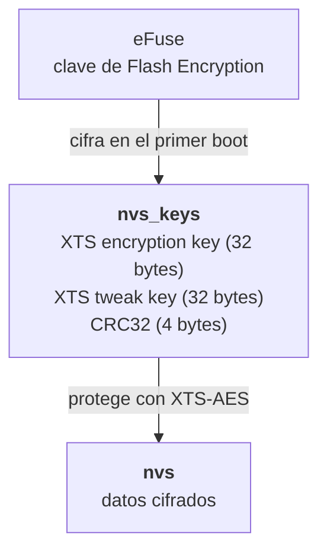
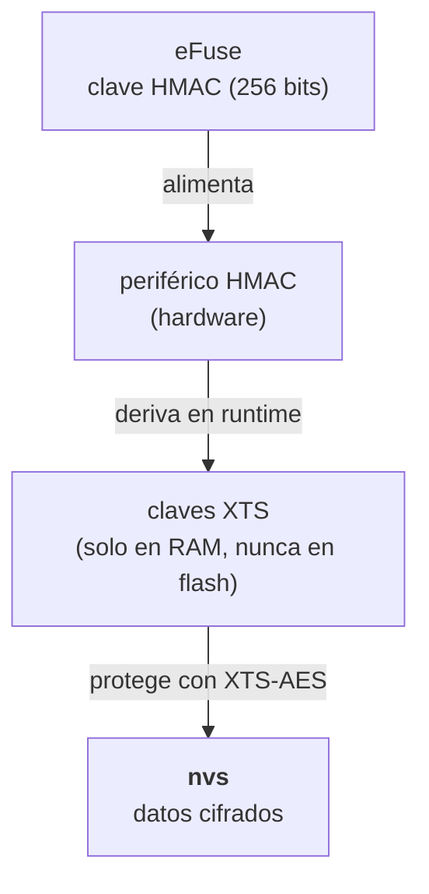

# Secrets en el Firmware

El problema más común en proyectos IoT con ESP32 es simple: la WiFi password, la MQTT password, y cualquier otra credencial terminan hardcodeadas en el código fuente. Cuando eso pasa, también terminan en el binario `.bin` que se flashea al chip. Cualquiera que tenga acceso físico al nodo puede extraer ese binario con `esptool.py` y leer las credenciales en texto plano. Y rotar credenciales hardcodeadas requiere reflashear cada nodo individualmente.

## NVS: sacar las credenciales del binario

ESP-IDF expone NVS (Non-Volatile Storage): una partición clave-valor en flash, separada del firmware. Las credenciales se guardan ahí, se programan una vez por nodo vía `esptool.py` o por consola serial al primer boot, y el firmware las lee en runtime. El resultado es que el binario en el repositorio no contiene ninguna credencial —es 100% público sin riesgo.

El límite de NVS plano es que si alguien extrae la flash del chip, lee las credenciales igual. Para eso existe NVS Encryption.

Documentación: [ESP-IDF NVS](https://docs.espressif.com/projects/esp-idf/en/latest/esp32/api-reference/storage/nvs_flash.html)

## NVS Encryption: credenciales cifradas en reposo

NVS Encryption cifra el contenido de la partición NVS con XTS-AES, un modo de cifrado diseñado para almacenamiento en disco (estandarizado en IEEE Std 1619).[^nvs-enc-1] Usa dos claves independientes de 256 bits, cada una con un rol distinto:[^nvs-enc-xts]

- **Clave de cifrado**: cifra el bloque de datos de cada entrada NVS.
- **Clave de tweak**: cifra la dirección relativa de esa entrada dentro de la partición —su número de sector— para producir un valor único por posición. Ese valor se mezcla con el dato antes y después del cifrado AES.

El efecto es que el mismo dato guardado en dos entradas distintas produce texto cifrado diferente: un atacante no puede detectar que el valor se repite comparando bloques cifrados. Extraer la flash del chip da solo texto cifrado. La diferencia entre los dos esquemas disponibles está en dónde viven esas claves.

### Esquema basado en Flash Encryption

En este esquema, las dos claves XTS-AES se guardan en una partición especial llamada `nvs_keys`, protegida a su vez por Flash Encryption.[^nvs-enc-2] La cadena de protección es la siguiente:

La partición `nvs_keys` es de tipo `data`, subtipo `nvs_keys`, marcada como `encrypted` en el CSV de la [tabla de particiones](../hardware-esp32/tabla-de-particiones.md), con un tamaño mínimo de 4KB.[^nvs-enc-3] Al estar marcada como `encrypted`, el bootloader la cifra con la clave de Flash Encryption en el primer boot.[^nvs-enc-4]

Este esquema requiere que Flash Encryption esté habilitado en el chip. De hecho, cuando Flash Encryption está activo, NVS Encryption se habilita automáticamente para la partición NVS por defecto —porque el driver de WiFi guarda las credenciales ahí.[^nvs-enc-2]

### Esquema basado en HMAC

En chips con el periférico HMAC —ESP32-S2, S3, C3, H2, y posteriores; no disponible en el ESP32 clásico— existe un esquema alternativo. Lo que se burna al eFuse es una clave HMAC de 256 bits. Las claves XTS-AES se derivan de esa clave en runtime usando el periférico de hardware, y **nunca se escriben a la flash**:

No hace falta una partición `nvs_keys` ni habilitar Flash Encryption.[^nvs-enc-5] El único material comprometible es el eFuse —y acceder a él requiere ataques físicos como [Fatal Fury](fatal-fury-esp32.md) en chips pre-ECO V3.

Documentación: [ESP-IDF NVS Encryption](https://docs.espressif.com/projects/esp-idf/en/latest/esp32/api-reference/storage/nvs_encryption.html)

## WiFi Provisioning: credenciales que nunca tocan el firmware

Para nodos que otros tienen que configurar —o donde la rotación de credenciales tiene que ser sin acceso al código— la alternativa es provisioning: el nodo arranca en modo AP o BLE, expone una API, y el usuario provisiona las credenciales desde el celular. Las credenciales nunca están en el firmware ni en el repositorio.

ESP-IDF tiene un componente oficial ([ESP-IDF Provisioning](https://docs.espressif.com/projects/esp-idf/en/latest/esp32s3/api-reference/provisioning/wifi_provisioning.html)) que maneja el transporte cifrado (protocomm) vía HTTP o BLE. Las credenciales entran cifradas y quedan guardadas en NVS —idealmente con encryption.

SmartConfig (otra opción que aparece en tutoriales) transmite las credenciales por broadcast WiFi en plano. No usar.

## Cuándo usar qué

| Fase | Opción |
|---|---|
| Prototipado (1-3 nodos, no salen del escritorio) | `secrets.h` en `.gitignore` — mínimo para no commitear accidentalmente |
| Deployment inicial | NVS plano, programado al flashear |
| Producción | NVS Encryption — esquema Flash Encryption en ESP32 clásico, esquema HMAC en chips modernos |
| Nodos que configuran otros o requieren rotación sin reflashear | Provisioning + NVS Encryption |

## Si las credenciales se filtran

El vector más común es un commit accidental o un `.bin` compartido. El procedimiento de rotación depende de qué se filtró:

- **WiFi password**: cambiarla en el router desconecta todos los nodos. Hay que reprogramar el NVS de cada uno con la nueva password.
- **MQTT password**: revocar el usuario en Mosquitto, reprogramar NVS del nodo afectado, recrear el usuario con nueva password.
- **OTA key**: ver [OTA](ota.md) — las implicancias son distintas porque la clave puede estar burnada en eFuse.

Tener un script para reprogramar NVS de cada nodo es lo que hace la diferencia entre una rotación de 10 minutos y una tarde yendo físicamente a cada nodo del invernadero.

## Referencias

[^nvs-enc-1]: Espressif — [NVS Encryption, sección Overview](https://docs.espressif.com/projects/esp-idf/en/stable/esp32/api-reference/storage/nvs_encryption.html): *"Data stored in NVS partitions can be encrypted using XTS-AES in the manner similar to the one mentioned in disk encryption standard IEEE P1619. For the purpose of encryption, each entry is treated as one sector and relative address of the entry (w.r.t., partition-start) is fed to the encryption algorithm as sector-number."*

[^nvs-enc-2]: Espressif — [NVS Encryption, sección Flash Encryption-Based Scheme](https://docs.espressif.com/projects/esp-idf/en/stable/esp32/api-reference/storage/nvs_encryption.html): *"In this scheme, the keys required for NVS encryption are stored in yet another partition, which is protected using Flash Encryption. Therefore, enabling Flash Encryption becomes a prerequisite for NVS encryption here."* y *"NVS encryption is enabled by default when Flash Encryption is enabled. This is done because Wi-Fi driver stores credentials (like SSID and passphrase) in the default NVS partition."*

[^nvs-enc-3]: Espressif — [NVS Encryption, sección NVS Key Partition](https://docs.espressif.com/projects/esp-idf/en/stable/esp32/api-reference/storage/nvs_encryption.html): *"An application requiring NVS encryption support (using the Flash Encryption-based scheme) needs to be compiled with a key-partition of the type data and subtype nvs_keys. This partition should be marked as encrypted and its size should be the minimum partition size (4 KB)."*

[^nvs-enc-4]: Espressif — [NVS Encryption, sección NVS Key Partition](https://docs.espressif.com/projects/esp-idf/en/stable/esp32/api-reference/storage/nvs_encryption.html): *"Since the key partition is marked as encrypted and Flash Encryption is enabled, the bootloader will encrypt this partition using flash encryption key on the first boot."*

[^nvs-enc-xts]: Wikipedia — [Disk encryption theory, sección XTS](https://en.wikipedia.org/wiki/Disk_encryption_theory#XTS), que cita IEEE Std 1619-2007: *"The XTS standard requires using a different key for the IV encryption than for the block encryption."*

[^nvs-enc-5]: Espressif — [NVS Encryption, sección HMAC Peripheral-Based Scheme](https://docs.espressif.com/projects/esp-idf/en/stable/esp32s3/api-reference/storage/nvs_encryption.html): *"In this scheme, the XTS keys required for NVS encryption are derived from an HMAC key programmed in eFuse... Since the encryption keys are derived at runtime, they are not stored anywhere in the flash. Thus, this feature does not require a separate NVS Key Partition."* y *"This scheme enables us to achieve secure storage on ESP32-S3 without enabling flash encryption."*
