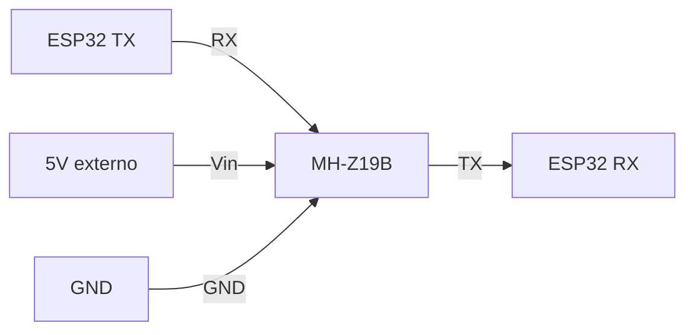

# MH-Z19B (Winsen)

Sensor NDIR de CO2 económico, ampliamente usado en proyectos de invernadero.

Páginas del fabricante: [Winsen MH-Z19B](https://www.winsen-sensor.com/sensors/co2-sensor/mh-z19b.html), [Datasheet MH-Z19B (PDF)](https://www.winsen-sensor.com/d/files/infrared-gas-sensor/mh-z19b-co2-ver1_0.pdf)
Ver tambien <https://emariete.com/sensor-co2-mh-z19b/>

## Specs

| Spec | Valor |
|---|---|
| Tecnología | NDIR (Non-Dispersive Infrared) |
| Rango | 0-5000 ppm |
| Precisión | $\pm 50\,\text{ppm}$ $\pm 3\%$ del valor medido |
| Interface | UART (9600 baud, 8N1) o PWM |
| Voltaje | 4.5-5.5V DC (no funciona a 3.3V) |
| Calentamiento | 3 min después de power-on |
| Consumo pico | 150 mA @5V (avg <60 mA) |
## CRÍTICO en invernadero - desactivar ABC

**ABC (Automatic Baseline Correction)** asume que el sensor **ve aire fresco exterior (400 ppm) al menos una vez cada 24h** y recalibra el cero a ese valor.

En un invernadero cerrado con CO2 elevado permanentemente (fertilización con CO2, plantas respirando), el ABC **recalibra continuamente con valores erróneos** y las lecturas derivan de forma no lineal en cuestión de semanas.

Con ABC desactivado el MH-Z19B sigue siendo metodológicamente válido; varios papers de agricultura de precisión lo usan así, declarándolo explícitamente en la sección de materiales.

### Comando UART para desactivar ABC

**Hacerlo una sola vez antes de instalar el sensor**, el setting se guarda en flash interno.

### Comando para leer CO2

## Implementación en ESP32

> El MH-Z19B consume hasta **150 mA en pico** durante el calentamiento del filamento IR. El regulador del DevKit puede no aguantar - alimentar desde un [LM2596S](../../electronica/potencia/lm2596s.md) directamente, no desde el 5V del DevKit.

UART config: 9600 baud, 8N1.

## Variante MH-Z19C

[MH-Z19C](mh-z19c.md) es similar pero con rango 0-2000 ppm.

## Trampas

| Síntoma | Causa |
|---|---|
| Lecturas siempre cerca de 400 ppm | ABC sigue activo |
| Lecturas se desplazan ~50 ppm cada semana | Sensor desgastado, requiere recalibración manual con N2 puro o aire de referencia |
| Primeras lecturas después de power-on son 400 ppm constantes | Falta el periodo de calentamiento (3 min) |
| Respuesta del sensor consume mucha CPU | Implementar timeout en `uart_read_bytes()`; el sensor responde cada 1 s, no más rápido |
