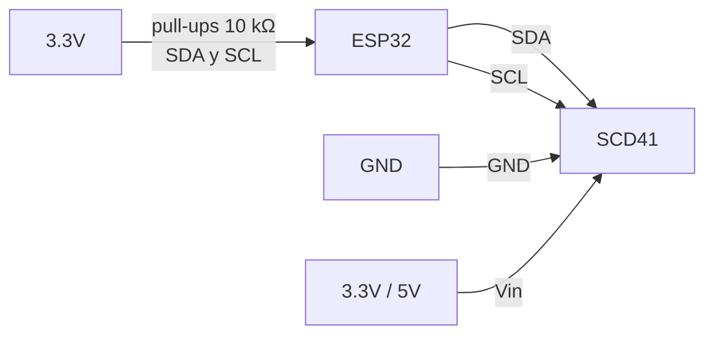

# SCD41 (Sensirion)

Sensor photoacoustic NDIR de CO2 - opción de mayor precisión con compensación interna.

Páginas del fabricante: [Sensirion SCD41](https://sensirion.com/products/catalog/SCD41), [Datasheet SCD4x (PDF)](https://sensirion.com/media/documents/48C4B7FB/67FE0194/CD_DS_SCD4x_Datasheet_D1.pdf)

## Specs

| Spec                             | Valor                                                                                                                                                                                                       |
| -------------------------------- | ----------------------------------------------------------------------------------------------------------------------------------------------------------------------------------------------------------- |
| Tecnología                       | PAS NDIR (Photoacoustic) - más estable a largo plazo que NDIR clásico                                                                                                                                       |
| Rango                            | 400-5000 ppm                                                                                                                                                                                                |
| Precisión                        | $\pm (50\,\text{ppm} + 2.5\%$ del valor$)$ en 400-1000 ppm; $\pm (40\,\text{ppm} + 5\%)$ en 2001-5000 ppm                                                                                                   |
| Interface                        | **I2C @ 0x62** - integrable con [SHT4x](../temperatura-humedad/sht45.md) y [AS7341](../luz/as7341.md) en el mismo bus                                                                                       |
| Voltaje                          | 2.4-5.5V (compatible con 3.3V)                                                                                                                                                                              |
| Compensación                     | Temperatura + humedad interna automática                                                                                                                                                                    |
| Power-up time                    | **30 ms max** (datasheet Table 7, line 448). El intervalo periódico de medición es 5s 
| ASC (Automatic Self Calibration) | Mismo problema que ABC del MH-Z19B en invernadero. Desactivar con comando `set_automatic_self_calibration_enabled = 0` (0x2416, word 0) **+ `persist_settings` (0x3615)** para que sobreviva el power-cycle |

## Ventaja sobre MH-Z19B

- **I2C en vez de UART** - comparte bus con otros sensores I2C, no necesita UART dedicado.
- **Compensación interna de T+HR** reduce la deriva y no requiere lecturas separadas para compensar.
- Mayor estabilidad a largo plazo (PAS NDIR > NDIR clásico).
- Citado directamente en literatura de horticultura de precisión.

## Breakout boards comunes

- [Adafruit SCD41 breakout (#5190)](https://www.adafruit.com/product/5190) con STEMMA QT
- [SparkFun SCD41 Qwiic](https://www.sparkfun.com/products/18365)

## Implementación esquemática

Driver: usar la librería oficial de Sensirion para ESP-IDF o Arduino. El SCD41 tiene comandos I2C estándar para iniciar mediciones periódicas (cada 5s) o single-shot.
