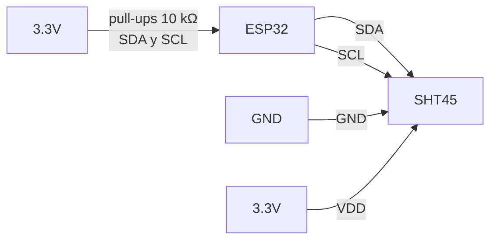

# SHT45 (Sensirion)

Sensor digital de temperatura + humedad relativa, generación 4 - **el más preciso de la familia SHT4x.**

Página del fabricante: [Sensirion SHT45](https://sensirion.com/products/catalog/SHT45), [Datasheet SHT4x (PDF)](https://sensirion.com/media/documents/33FD6951/67EB9032/HT_DS_Datasheet_SHT4x_5.pdf)

## Specs

| Spec | Valor |
|---|---|
| Precisión temperatura | **$\pm 0.1^\circ\text{C}$** típica |
| Precisión HR | **$\pm 1\%$ RH** típica |
| Drift temperatura | **< 0.03 $^\circ$C / año** (datasheet §2.2) - relevante para publicación |
| Drift HR | **< 0.2 %RH / año** (datasheet §2.1) |
| Heater | 3 niveles (20 / 110 / 200 mW) |
| Voltaje | 1.08-3.6V |
| Interface | I2C @ 0x44 |
| Tiempo de respuesta HR (τ63%) | 4 s (T: 2 s) |
> ⚠️ Acepta máx 3.6V. **No alimentar desde línea de 5V sin regulador.**

## Aislamiento térmico durante el deployment

Cita textual del [datasheet SHT4x](https://sensirion.com/media/documents/33FD6951/67EB9032/HT_DS_Datasheet_SHT4x_5.pdf) §5.1 "Hardware integration design":

> *"For maximum performance, the sensor should be located in a position where it is exposed to the gas to be measured, but isolated from any heat sources such as nearby electronics or direct sunlight."*

Fuentes de calor a evitar en un nodo de invernadero:

- **Reguladores lineales** (LDOs como AMS1117, LM1117) - disipan el exceso de voltaje como calor. Preferir [LM2596S](../../electronica/potencia/lm2596s.md) switching que se mantiene a temperatura ambiente. Ver explicación detallada en [`potencia/lm2596s.md`](../../electronica/potencia/lm2596s.md)
- **El propio ESP32** durante TX intensivo de WiFi/BLE (puede subir 10-15 $^\circ$C el chip)
- **Bombas, relays, MOSFETs de potencia** que conmutan cargas grandes
- **Luz solar directa sobre el gabinete** (efecto invernadero dentro de la caja)

Para nodos ambientales donde la T del aire es la variable principal, lo recomendado es **separar físicamente el sensor del nodo** vía un cable de ~30-50 cm, con el sensor en un radiation shield ventilado y la electrónica en otra caja a la sombra.

## Variantes - atención al sufijo

| Part number | Filtro PTFE | Versión |
|---|---|---|
| `SHT45-AD1B-R3` | Sin filtro | Nueva |
| `SHT45-AD1B-R2` | Sin filtro | Anterior |
| **`SHT45-AD1F-R2`** | **Con filtro PTFE** | Para ambientes con condensación / salpicaduras |

## Por qué el sufijo F (filtro PTFE)

El filtro PTFE es una membrana microporosa que deja pasar vapor de agua pero bloquea polvo, tierra y salpicaduras líquidas. Sin filtro, una gota sobre la apertura te lleva a 100% RH instantáneo y tarda minutos en recuperarse, lo que arruina la serie temporal. En invernaderos con nebulización o riego por aspersión el filtro no es opcional.

## Disponibilidad

- [Digi-Key SHT45-AD1F-R2](https://www.digikey.com/en/products/detail/sensirion-ag/SHT45-AD1F-R2/16586427) (Cut Tape para prototipado)
- [Adafruit SHT45 breakout (#5665)](https://www.adafruit.com/product/5665) con STEMMA QT (usa la variante con filtro)

## Implementación I2C (esquema)

### Driver mínimo en ESP-IDF

> Validar CRC de los bytes `data[2]` y `data[5]` antes de confiar en la medición - Sensirion documenta el polinomio CRC-8 en el datasheet.
